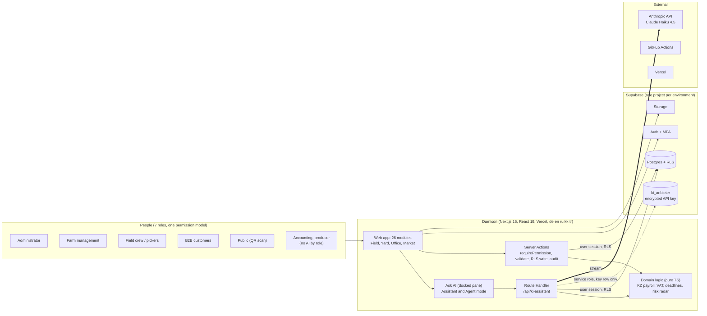
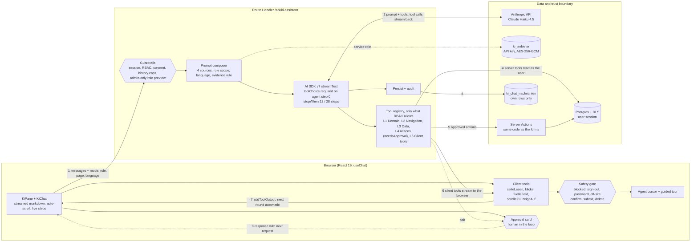
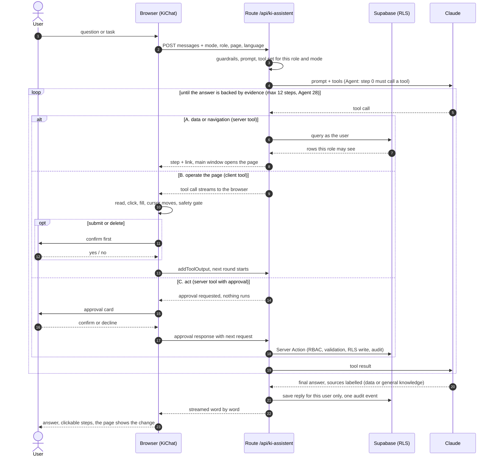

# Damicon architecture

Damicon is a raspberry farm traceability and operations platform for Kazakhstan. This folder documents the system and, in depth, the "Ask AI" agent.

| Artifact | What it is |
| --- | --- |
| [`damicon-agent.drawio`](damicon-agent.drawio) | Editable source, 3 pages (open in diagrams.net or the VS Code draw.io extension) |
| [`1-ecosystem.png`](1-ecosystem.png) | Level 1 and 2: people, Damicon, Supabase, external systems |
| [`2-agent-architecture.png`](2-agent-architecture.png) | Level 3: components of the agent |
| [`3-agent-turn.png`](3-agent-turn.png) | Level 4: one agent turn, end to end |
| This file | The same content as Mermaid, rendered natively by GitHub |

Structure follows the C4 model: context, containers, components, then one dynamic view.

## Level 1 and 2: ecosystem

## Level 3: the agent

### Tool layers

| Layer | Tools | Runs | Adapts automatically |
| --- | --- | --- | --- |
| L1 Domain | VAT, ESUTD, compliance, cold chain, risk radar | Server, user session | Per-source permission check |
| L2 Navigation | `oeffneBereich` | Server, result opens the main window | Derived from `modules.ts`, so a new module is reachable and described |
| L3 Data | `datenmodellErkunden`, `datenLesen` | Server, user session under RLS | Schema discovered from PostgREST, so a new table is readable. Denylist for keys, audit, chat history, queues |
| L4 Actions | 7 actions (task, cooling reading, complaint, payroll, VAT check, task status, hand-over) | Server, after approval | One registry entry per action, wrapping the same Server Action as the form |
| L5 Client | `seiteLesen`, `klicke`, `fuelleFeld`, `scrolleZu`, `zeigeAuf` | Browser (`onToolCall`, `addToolOutput`) | Works on any page through a page snapshot with element refs |

### Guarantees

| Principle | How it is enforced |
| --- | --- |
| Security by absence | A tool the role may not use is never offered to the model |
| RLS is the boundary | The agent acts with the user's own session, it sees what the user sees |
| Human in the loop | Every action needs approval. In the browser, submit and delete need confirmation, sign-out and password fields are blocked |
| Evidence before claims | Success is reported only after proof. An unsent or invalid form is never reported as success |
| Self-adapting | New module: reachable. New table: readable. New action: one registry entry. `npm run test:agent` checks all of it |
| Private history | `ki_chat_nachrichten` has RLS plus an explicit profile filter, the agent cannot read it |
| Key handling | Provider key encrypted with AES-256-GCM, read only by the service-role client, never in the repository |

## Level 4: one agent turn

## Regenerating the draw.io file

The `.drawio` is plain mxGraph XML and can be edited by hand in diagrams.net. Keep the PNGs and the Mermaid blocks in sync when you change it.

Colour legend: blue is browser, green is server, purple is AI provider, yellow is database and secrets, red is a safety or trust boundary, grey is external.
