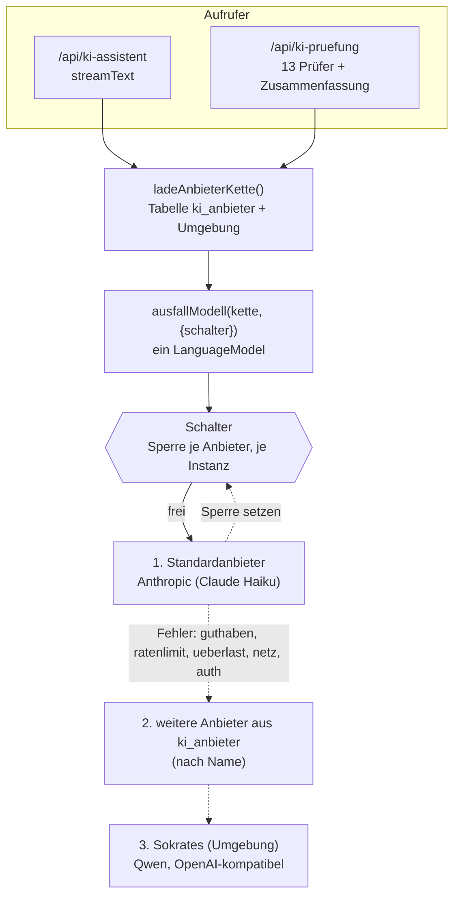
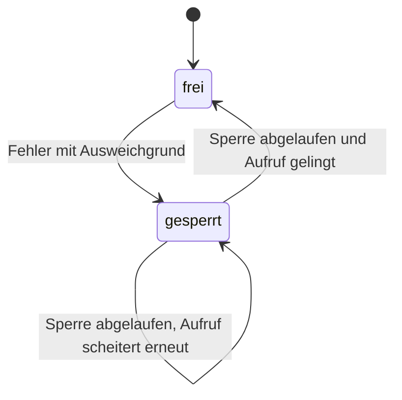

# KI-Ausfallsicherheit: Entwurf und Umsetzung

| | |
| --- | --- |
| **Gegenstand** | Automatischer Wechsel des Sprachmodell-Anbieters, wenn der bevorzugte ausfällt (Guthaben leer, Ratenlimit, Überlast, Netz, Berechtigung) |
| **Stand** | 2026-09-20, Pull Request #89 (Kette und Schutzschalter), Feinschliff in #92 (Denkphase aus) |
| **Code** | `src/lib/ai/ausfall.ts`, `src/lib/ai/ausfall-modell.ts`, `src/lib/ai/anbieter-kette.ts`, Nutzer in `src/app/api/ki-assistent/route.ts` und `src/app/api/ki-pruefung/route.ts` |
| **Test** | `npm run test:ausfall` (36 Prüfungen) |
| **Verwandt** | [Compliance-Prüfung](pruefung-entwurf.md), [Wissensbasis in Supabase](wissensbasis-supabase.md) |

## Inhalt

1. [Anlass und Ziel](#1-anlass-und-ziel)
2. [Architektur](#2-architektur)
3. [Fehler einordnen](#3-fehler-einordnen)
4. [Der Schutzschalter](#4-der-schutzschalter)
5. [Das Kettenmodell](#5-das-kettenmodell)
6. [Konfiguration](#6-konfiguration)
7. [Sokrates als Ausweichanbieter](#7-sokrates-als-ausweichanbieter)
8. [Beobachtbarkeit](#8-beobachtbarkeit)
9. [Messwerte](#9-messwerte)
10. [Störungen und ihre Behandlung](#10-störungen-und-ihre-behandlung)
11. [Betriebshandbuch](#11-betriebshandbuch)
12. [Entscheidungen](#12-entscheidungen)
13. [Grenzen](#13-grenzen)

---

## 1. Anlass und Ziel

Am 2026-09-20 meldete die Produktion `Your credit balance is too low to access the Anthropic API`. Ohne Ausweichweg endete jede Frage im Assistenten und jede Prüfung mit einem Fehler. Ziel: **Die Anwendung antwortet weiter**, auch wenn ein Anbieter ausfällt, ohne dass sich für Aufrufer, Oberfläche oder Rollenrechte etwas ändert, und ohne dass ein Ersatzanbieter unbemerkt zum Hauptmodell wird.

**Leitgedanken**

- Für Aufrufer (`streamText`, `generateText`, jeder Schritt einer Werkzeugschleife) ist die Kette **ein ganz normales Modell**. Es ändert sich keine Anwendungslogik.
- Ein Wechsel ist eine **Entscheidung des Betreibers** (Konfiguration), keine Überraschung: ohne benutzbaren Standardanbieter gibt es keine Kette.
- **Nur wechseln, wenn ein anderer Anbieter helfen kann.** Eine fehlerhafte Anfrage (400) würde bei jedem Anbieter scheitern und wird nicht weitergereicht.
- Ein Fehler mitten in einer laufenden Antwort wird **nicht** ersetzt (der Nutzer hat schon Text gesehen; ein zweiter Anbieter würde von vorn beginnen und doppeln).

---

## 2. Architektur

**Reihenfolge der Kette.** Standardanbieter aus `ki_anbieter` (`ist_standard`), danach alle weiteren aktiven Anbieter nach Name, danach Sokrates aus der Umgebung. Mit `KI_ZUERST=sokrates` steht Sokrates vorn (Claude als Ersatz). Der Standardanbieter muss selbst benutzbar sein (Schlüssel entschlüsselbar); sonst wird **keine** Kette gebaut und die Route antwortet 409, damit ein Ersatz nie stillschweigend zum Hauptmodell wird. Ein Anbieter mit kaputtem Schlüssel wird übersprungen und reißt die anderen nicht mit.

---

## 3. Fehler einordnen

`klassifiziere(fehler)` ordnet jeden Fehler ein (HTTP-Status, Meldungstext, Netzcodes). `darfAusweichen(art)` entscheidet, ob ein anderer Anbieter helfen kann.

| Art | Erkennung (Auszug) | Ausweichen | Sperre |
| --- | --- | --- | --- |
| `guthaben` | Meldungstext ("credit balance is too low", "insufficient quota", "billing" u. a.) oder Status 402; **der Text zählt, nicht der Status** | ja | 5 min |
| `ratenlimit` | 429, "rate limit" | ja | `Retry-After` (mindestens 10 s, höchstens 5 min; ohne Angabe 30 s) |
| `ueberlast` | 529 und jeder 5xx-Status, "overloaded", "temporarily unavailable" | ja | 30 s |
| `netz` | `fetch failed`, `ECONNRESET`, Zeitüberschreitung | ja | 20 s |
| `auth` | 401, 403 (Schlüssel ungültig oder nicht freigegeben) | ja | 5 min |
| `anfrage` | 400, 404, 413, 422 (fehlerhafte Anfrage), sofern kein Guthabentext vorliegt | **nein** | keine |
| `unbekannt` | alles andere | **nein** | keine |

Dass Anthropic aufgebrauchtes Guthaben als **400** meldet (und nicht als 402), war der Kern des Vorfalls: ein naives "400 heißt kaputte Anfrage" hätte hier nicht ausgewichen.

---

## 4. Der Schutzschalter

`Schalter` (ein Exemplar je Serverinstanz) merkt sich je Anbieter, bis wann er gesperrt ist und warum. Nach einem Fehler springt die nächste Anfrage **direkt** zum nächsten Anbieter, statt erneut auf die volle Zeitüberschreitung des kaputten zu warten. Läuft die Sperre ab, wird der Anbieter wieder versucht; gelingt er, wird die Sperre geschlossen.

- Die Uhr ist einspeisbar (`jetzt`), damit Tests die Sperrzeiten ohne Warten prüfen.
- Sind **alle** Anbieter gesperrt, wird der versucht, dessen Sperre **zuerst** endet (`fruehesteFreigabe`), statt sofort mit einem Fehler zu antworten.
- Eine Sperre gilt für alle Anfragen **dieser Instanz**. Bei mehreren Instanzen lernt jede für sich; das ist bewusst einfach gehalten (kein gemeinsamer Speicher nötig).

---

## 5. Das Kettenmodell

`ausfallModell(kette, { schalter, beiAusweichen })` liefert ein `LanguageModel`, das die Aufrufe an das erste freie Kettenglied delegiert und die Spezifikationsversion des ersten Glieds übernimmt (die Anbieter-Pakete erzeugen Modelle derselben Version).

Es gibt **zwei Stellen**, an denen ein Fehler auftreten kann:

1. **Beim Aufruf** (HTTP-Status): `probiere()` fängt ihn ab und geht zum nächsten Glied.
2. **Als erstes Ereignis des Stroms**: Anthropic meldet "overloaded" gelegentlich erst im Strom, nach erfolgreicher Verbindung. `ersterTeil()` liest den Strom bis zum ersten inhaltlichen Teil (Vorspann wie `stream-start` wird gepuffert); ist das ein Fehler mit Ausweichgrund, wird er geworfen und das nächste Glied versucht. Solange noch nichts an den Nutzer ging, ist das unsichtbar.

Ein Fehler **nach** dem ersten inhaltlichen Teil wird durchgereicht (siehe Leitgedanken). Gibt es kein weiteres Glied, wird der letzte Fehler geworfen; leere Ketten werden abgelehnt.

---

## 6. Konfiguration

| Einstellung | Wo | Bedeutung |
| --- | --- | --- |
| Standardanbieter und weitere Anbieter | Panel, Zahnrad, Anbieter (Tabelle `ki_anbieter`) | Typ `anthropic` oder `openai_kompatibel`, Modell, Basis-URL, verschlüsselter Schlüssel |
| `KI_SOKRATES_API_SCHLUESSEL` | Umgebung (Vercel) | Schlüssel der Sokrates-API; aktiviert Sokrates als Ersatz **und** die Einbettung der Wissensbasis |
| `KI_SOKRATES_MODELL` | Umgebung, optional | Modell (Standard `qwen3.8-27b`) |
| `KI_SOKRATES_URL` | Umgebung, optional | Basis-URL (Standard `https://sokrates.test-qualitaetsmanagement.com/api/v1`) |
| `KI_ZUERST` | Umgebung, optional | `sokrates`: Sokrates zuerst, Claude als Ersatz. **Nicht empfohlen**, solange Sokrates langsamer ist |
| `KI_SOKRATES_DENKEN` | Umgebung, optional | `an`: Denkphase des Qwen-Modells eingeschaltet (Standard: aus) |

Ist die Basis-URL von Sokrates schon als Anbieter in der Tabelle eingetragen, wird der Umgebungseintrag nicht doppelt aufgenommen. Schlüssel gehören **nie** in den Quelltext oder in Commits, nur in die Umgebung oder (verschlüsselt) in die Tabelle.

---

## 7. Sokrates als Ausweichanbieter

Sokrates bietet eine OpenAI-kompatible Schnittstelle (`/chat/completions`, `/embeddings`) mit mehreren Modellen (`sokrates-pro`, `qwen3.8-27b`, `qwen3.6-35b`, `gemma4-31b` und weitere). Angebunden über `@ai-sdk/openai-compatible`.

**Modellwahl.** `qwen3.8-27b`: Werkzeugaufrufe (auto, required, erzwungen) und Streaming funktionieren; `sokrates-pro` ist mit 4 bis 20 s je Aufruf deutlich langsamer.

**Denkphase aus.** Qwen "denkt" standardmäßig, bevor das erste Wort kommt. Mit dem großen Systemprompt und den Werkzeugen der Anwendung kostete das viel Zeit. Der Ersatzanbieter setzt deshalb `reasoning_effort: "none"` über `transformRequestBody` (per `KI_SOKRATES_DENKEN=an` wieder einschaltbar). Wirkung, gemessen: erstes Wort 4,3 s auf 0,6 s; vollständige Antwort mit Wissenssuche im Ausweichbetrieb 88 s auf 55 s.

**Einordnung.** Sokrates ist als **Ersatz** gedacht. Bei Claude dauert dieselbe Antwort 10 bis 12 s. Solange der Abstand so groß ist, bleibt Claude Erstwahl.

---

## 8. Beobachtbarkeit

| Signal | Wo | Inhalt |
| --- | --- | --- |
| Logzeile | Serverprotokoll (Vercel) | `[damicon] Anbieterwechsel: <von> -> <nach> (<art>): <Meldung>` |
| Audit-Protokoll Chat | `ki_chat.nachricht`, Metadaten | `anbieter_name` mit Zusatz `(Ersatz: <nach>)`, `anbieterwechsel: ["von->nach:art"]` |
| Audit-Protokoll Prüfung | `compliance_pruefung_abgeschlossen` | `anbieterwechsel` des Laufs; im Bericht steht das Modell mit dem Zusatz "mit Ausweichanbieter ..." |

**Beispiel aus einem echten Ausfall (lokal, Guthaben leer):** `Anbieterwechsel: claude-haiku-lokal -> sokrates (guthaben): Your credit balance is too low ...`. Die Antwort kam danach über Sokrates-Qwen, mit Wissenssuche und Fundstellen.

---

## 9. Messwerte

| Fall | Ergebnis |
| --- | --- |
| Claude Haiku, Frage mit Wissenssuche (ganze Antwort) | 10 bis 12 s |
| Sokrates-Qwen, Denkphase an, gleiche Frage | 62 bis 88 s |
| Sokrates-Qwen, Denkphase aus | rund 55 s (davon etwa 17 s bis zum ersten Werkzeugschritt, der Rest die Länge der Antwort) |
| Sokrates, kleiner Prompt, erstes Wort | 0,6 s (Denkphase aus) gegenüber 4,3 s (an) |
| Einbettung (Sokrates, bge-m3) | 0,7 s je Anfrage, Vektoren identisch mit dem lokalen bge-m3 (Kosinus ab 0,99998) |
| Prüfung mit echtem Claude (13 parallele Prüfer) | etwa 30 s |

Die Werte stammen aus lokalen Läufen auf einem stark belasteten Rechner und sind Größenordnungen, keine Zusagen.

---

## 10. Störungen und ihre Behandlung

| Störung | Verhalten |
| --- | --- |
| Anthropic-Guthaben leer | Wechsel zu Sokrates, Sperre 5 min, Logzeile, Audit-Vermerk |
| Ratenlimit (z. B. 13 gleichzeitige Prüfer) | Wechsel, Sperre nach `Retry-After`; danach wird Anthropic wieder versucht |
| Anthropic überlastet, auch erst im Strom | Wechsel, sofern noch nichts an den Nutzer ging |
| Fehler mitten in der Antwort | wird durchgereicht (kein Doppeln), der Nutzer sieht den Fehler der Oberfläche |
| Sokrates ebenfalls gesperrt oder ausgefallen | Fehler des letzten Anbieters; die Oberfläche zeigt die vorhandene Ausweichantwort |
| Fehlerhafte Anfrage (400 ohne Guthabentext) | kein Wechsel, Fehler sofort |
| Standardanbieter nicht benutzbar | keine Kette, Route 409 `kein-anbieter` |
| Schlüssel eines weiteren Anbieters kaputt | dieser wird übersprungen, Warnung im Protokoll |

---

## 11. Betriebshandbuch

**Guthaben ist leer, aber die Konsole zeigt Guthaben.** Guthaben gehört in Anthropic zu einer **Organisation**. Im Fehlerprotokoll steht die Organisations-ID (`anthropic-organization-id`) und der Workspace. In der Anthropic-Konsole die Organisation wechseln und prüfen, welche die genannte ID trägt und in welcher der verwendete Schlüssel liegt. Liegt das Guthaben in einer anderen Organisation, dort einen neuen Schlüssel erzeugen und im Panel eintragen. Auch eine noch nicht abgeschlossene Zahlung oder ein Monatslimit erzeugen diese Meldung.

**Prüfen, ob die Ersatzkette bereit ist.**

1. In Vercel ist `KI_SOKRATES_API_SCHLUESSEL` gesetzt (die Umgebungsvariablen sind für die Projektrolle nicht lesbar; im Zweifel im Vercel-Dashboard nachsehen).
2. Nach dem Deploy eine Frage im Assistenten stellen. Bei ausgefallenem Anthropic muss die Antwort trotzdem kommen und im Protokoll `Anbieterwechsel` stehen.

**Nach dem Neustart des Servers** ist der Schutzschalter zurückgesetzt (er lebt im Speicher der Instanz). Nach einer Aufladung genügt es, bis zum Ablauf der Sperre (höchstens 5 Minuten) zu warten oder die Instanz neu zu starten.

**Schlüssel wechseln.** Beide Schlüssel (Anthropic, Sokrates) sind in einer Unterhaltung aufgetaucht und sollten getauscht werden. Anthropic: im Panel (Zahnrad, Anbieter). Sokrates: in der Umgebung, danach neu deployen.

---

## 12. Entscheidungen

| Nr. | Entscheidung | Begründung | Verworfen |
| --- | --- | --- | --- |
| A1 | Kette als ein `LanguageModel`, kein eigener Aufrufweg | keine Änderung an `streamText`, Werkzeugschleifen, Rollenlogik | Wiederholung in jeder Route |
| A2 | Ausweichen nur bei Fehlerarten, bei denen ein anderer Anbieter helfen kann | eine kaputte Anfrage scheitert überall, Wechsel verschleiert Fehler | jeden Fehler weiterreichen |
| A3 | Schutzschalter im Speicher der Instanz | einfach, keine zusätzliche Infrastruktur, Ausfälle sind kurz | gemeinsamer Zustand in Redis oder Datenbank |
| A4 | Fehler im ersten Stromereignis ebenfalls abfangen | Anthropic meldet Überlast teils erst im Strom | nur HTTP-Fehler beim Aufruf |
| A5 | Fehler mitten in der Antwort nicht ersetzen | kein doppelter Text, keine widersprüchliche Antwort | Antwort mit anderem Anbieter neu beginnen |
| A6 | Ohne benutzbaren Standardanbieter keine Kette | ein Ersatz soll nie stillschweigend zum Hauptmodell werden | erster funktionierender Anbieter |
| A7 | Claude Erstwahl, Sokrates Ersatz | Geschwindigkeit und Qualität, Abstand gemessen | Sokrates als Standard (per `KI_ZUERST` möglich, nicht empfohlen) |
| A8 | Denkphase des Ersatzmodells aus | erstes Wort und Gesamtdauer deutlich kürzer | Standardverhalten des Modells |

---

## 13. Grenzen

- **Qualität und Tempo unterscheiden sich.** Antworten über Sokrates-Qwen sind langsamer und können im Ton abweichen; die Rechte der Rolle und die Belegpflicht gelten unverändert.
- **Die Sperre gilt je Instanz.** Bei vielen Instanzen probiert jede den kaputten Anbieter einmal, bevor sie lernt.
- **Schub bei der Prüfung.** 13 gleichzeitige Prüfer sind ein Lastschub; bei niedriger Anthropic-Stufe kann ein Limit ansprechen. Die Kette fängt das ab, die Stufe des Kontos sollte zur Nutzung passen.
- **Kein Wechsel zurück mitten in einer Antwort.** Ein Anbieter wird erst bei der nächsten Anfrage wieder versucht.
- **Kosten.** Der Ersatzanbieter verursacht eigene Kosten oder Kontingente; im Audit-Protokoll ist sichtbar, wie oft er einsprang.
