# Prozess 1 — Von der Ernte bis zum Kunden

Klickanleitung anhand der 16 Screenshots aus `docs/prozesse/bilder/`. Jeder Schritt zeigt Rolle, Seite, Aktion und das Ergebnis auf dem Bildschirm. Alle Oberflächentexte sind wörtlich aus der deutschen Oberfläche übernommen.

| # | Rolle | Seite (URL) | Klick / Eingabe | Ergebnis auf dem Bildschirm |
|---|---|---|---|---|
| 1 | Brigade | `/de/dashboard` | Maus auf die Zonen-Kachel „Feld" | Startansicht mit KPI-Kacheln, „Feld" hervorgehoben |
| 2 | Brigade | `/de/dashboard/feld/pflueckaufgaben` | — | Liste „Pflückaufgaben heute", eine Aufgabe ausgewählt |
| 3 | Brigade | `/de/dashboard/feld/pflueckaufgaben?aufgabe=…` | Aufgabe mit Status „in Arbeit" angeklickt | Aufgabendetail mit dem Erfassungsformular |
| 4 | Brigade | dieselbe Seite | „Ist-Menge in kg" = 38,5, „Ausschuss in kg" = 1,8 | Werte im Formular, Cursor auf „Menge melden und zur Belegprüfung geben" — noch nicht gespeichert |
| 5 | Brigade | dieselbe Seite | Datei unter „Foto" gewählt, „Hinweis" ausgefüllt | Fotobeleg angehängt, Cursor auf „Fotobeleg hochladen" |
| 6 | Brigade | dieselbe Seite | „Ausweis scannen" | Scan-Feld für Steige und Pflücker-Ausweis sichtbar |
| 7 | Brigade | `/de/dashboard/feld/pflueckaufgaben?aufgabe=…` (Status „abgeschlossen") | — | Bestätigung nach dem Speichern: Fotobeleg-Panel der abgeschlossenen Aufgabe |
| 8 | Brigade | dieselbe Seite, Gerät offline | „Menge melden…" ohne Netzverbindung | Meldung „Erfasst - wird gesendet, sobald wieder Netz da ist." |
| 9 | Betriebsleitung | `/de/dashboard/hof/qr-steigen` | — | Etiketten für Steigen mit QR-Code und Klartext-Code |
| 10 | Betriebsleitung | `/de/dashboard/hof/kuehlkette` | — | „Kühlketten-Uhr", Liste „Zuletzt gemessen" |
| 11 | Betriebsleitung | dieselbe Seite | — | Charge mit Status „Verstoß" (Kühlkette über 60 Minuten) |
| 12 | Betriebsleitung | `/de/dashboard/hof/logistik` | Lieferung angelegt, Adresse gespeichert, Tour erstellt | Abholrunde mit optimierter Route auf der Karte (OSRM/OpenStreetMap) |
| 13 | Brigade | `/de/dashboard/hof/logistik` | — | Übergabequittung vor der Bestätigung, Status „geplant" |
| 14 | Brigade | dieselbe Seite | „Empfänger" ausgefüllt, „Übergabe erfassen" geklickt | Status „zugestellt" mit Zeitstempel und Empfängername |
| 15 | — (keine Anmeldung) | `/de/herkunft` | — | Suchfeld der öffentlichen Herkunftsauskunft |
| 16 | — (keine Anmeldung) | `/de/herkunft/hk_…` | — | Herkunftsauskunft der Charge: Reihenblock, Sorte, Erntetag, Kühlzeit |

## Screenshots

### 1. Dashboard (Brigade)
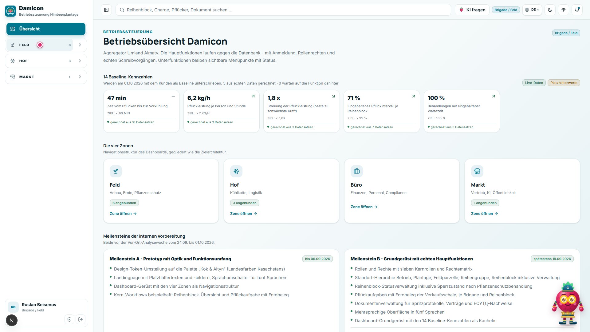

### 2. Pflückaufgaben-Liste
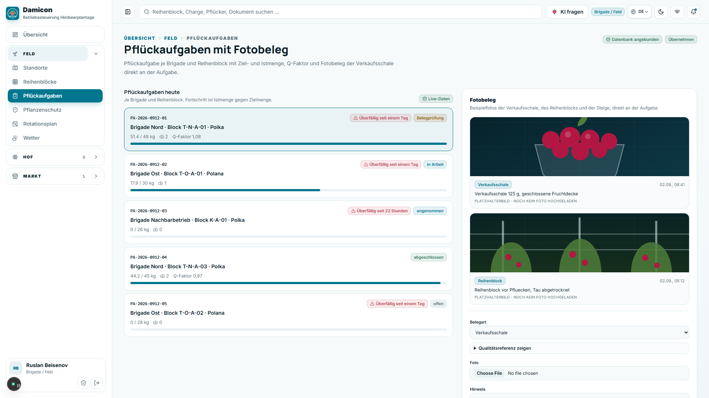

### 3. Aufgabendetail
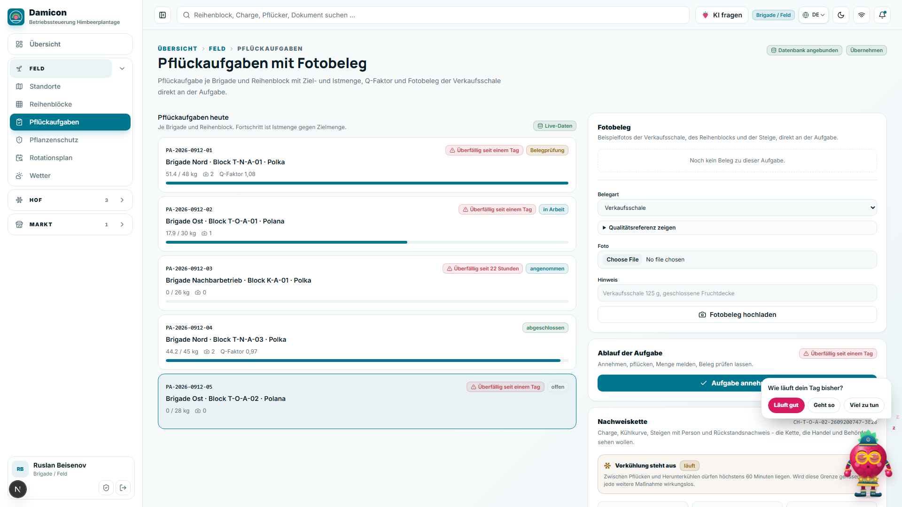

### 4. Menge und Ausschuss
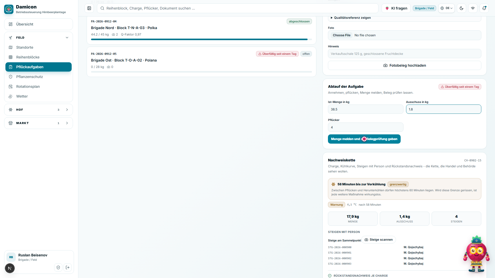

### 5. Fotobeleg
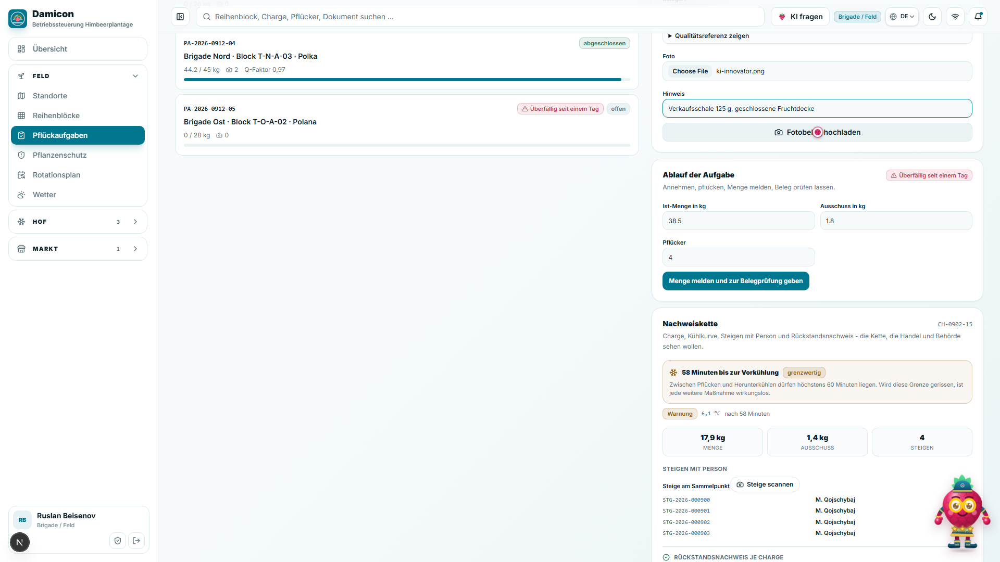

### 6. Steige-/Ausweis-Scan
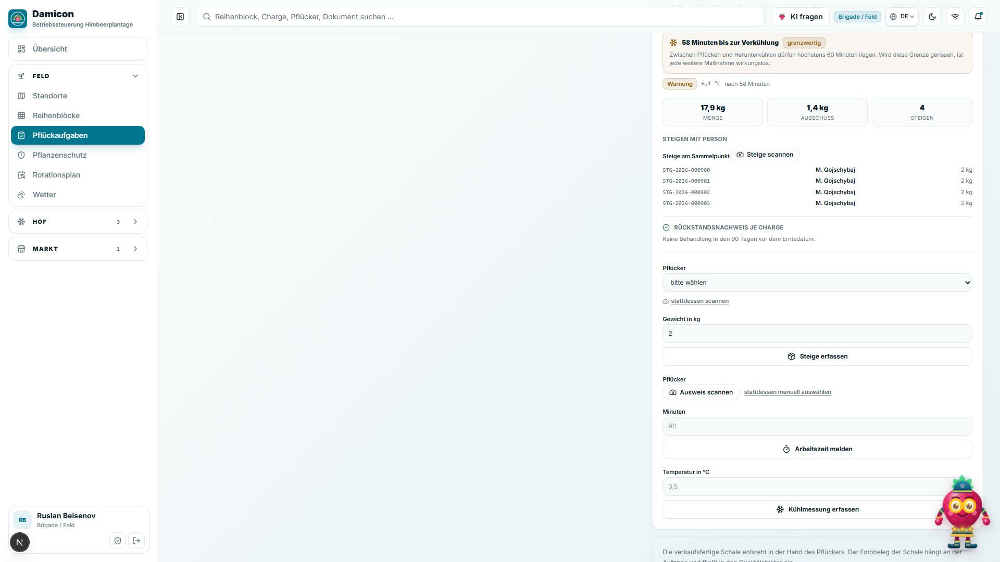

### 7. Aufgabe gespeichert
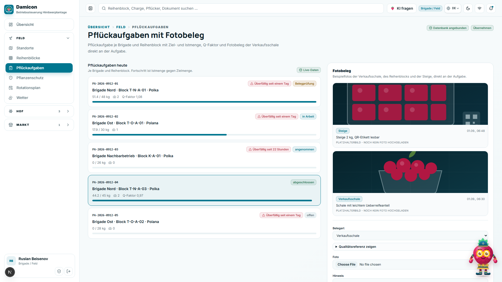

### 8. Offline-Warteschlange (optional)
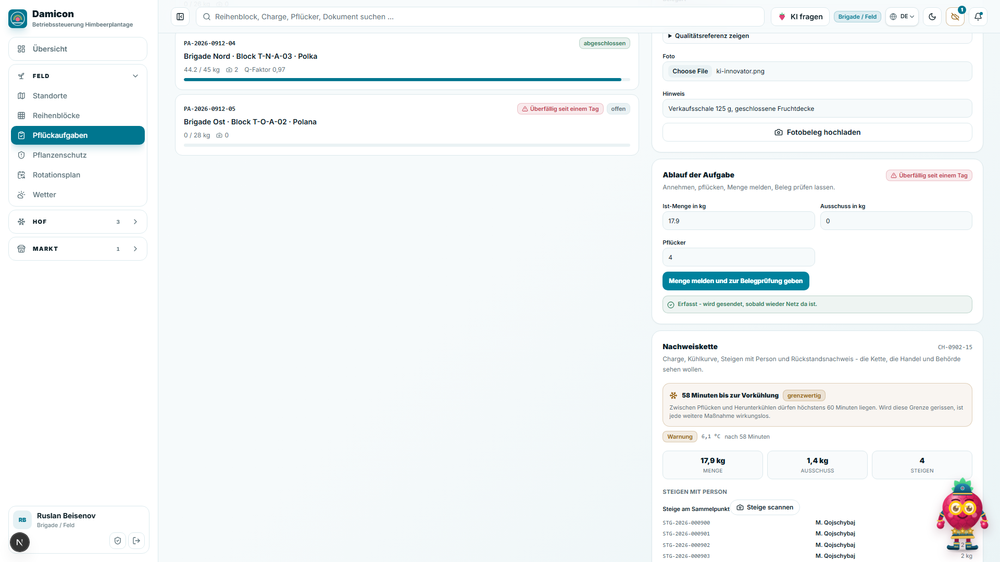

### 9. QR-Etikett
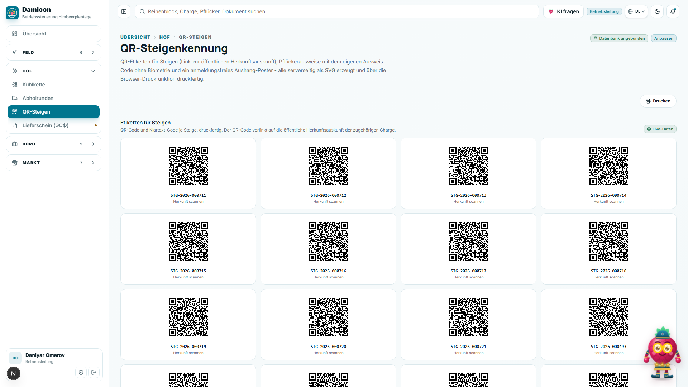

### 10. Kühlketten-Countdown
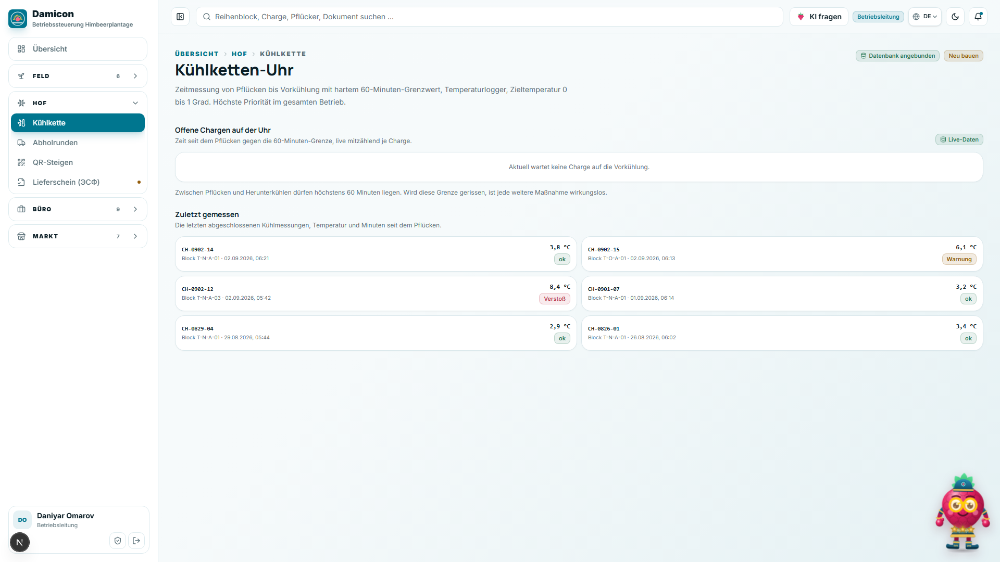

### 11. Kühlketten-Alarm (optional)
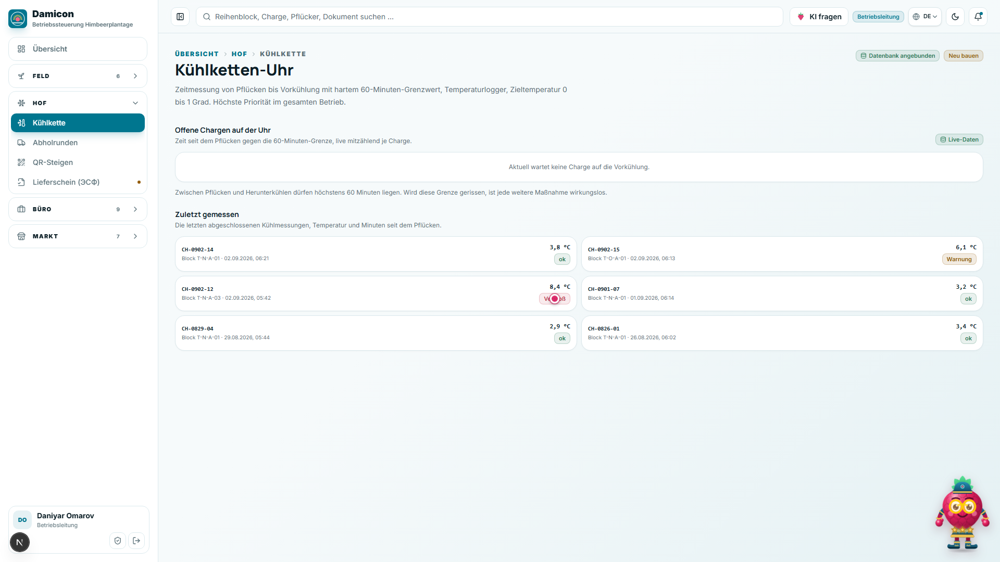

### 12. Logistik-Tour
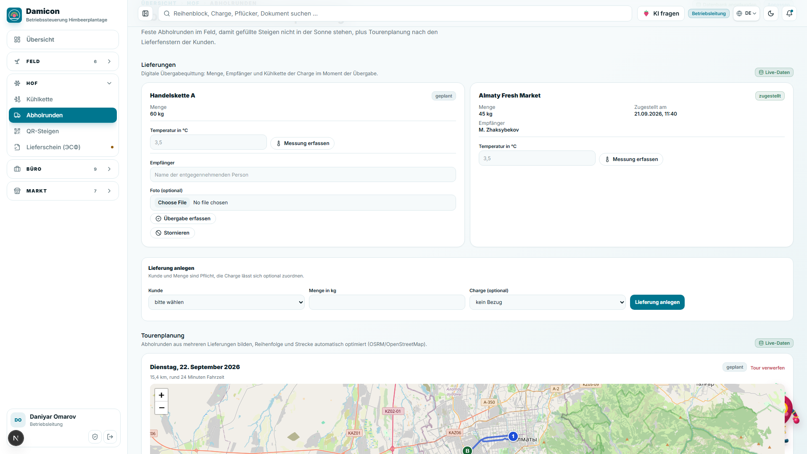

### 13. Übergabe vorher
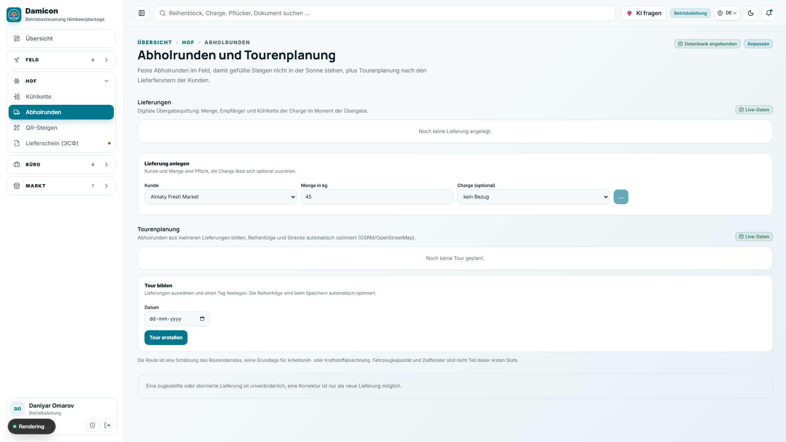

### 14. Übergabe bestätigt
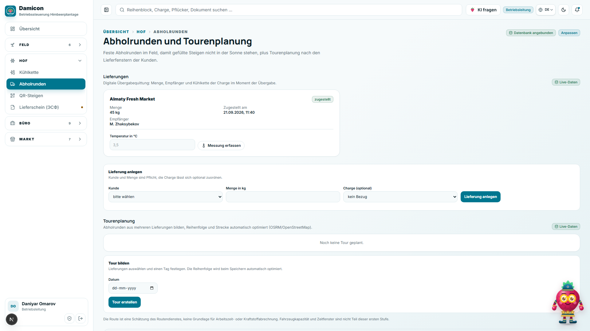

### 15. Herkunft-Suche (öffentlich)
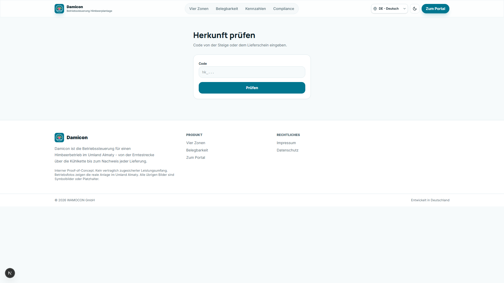

### 16. Herkunft-Ergebnis (öffentlich)
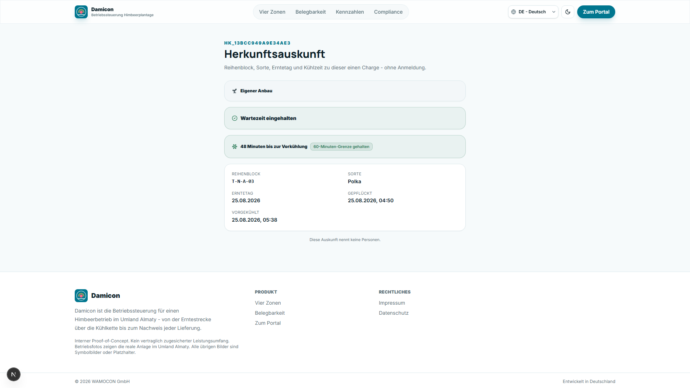

## Ablaufdiagramm

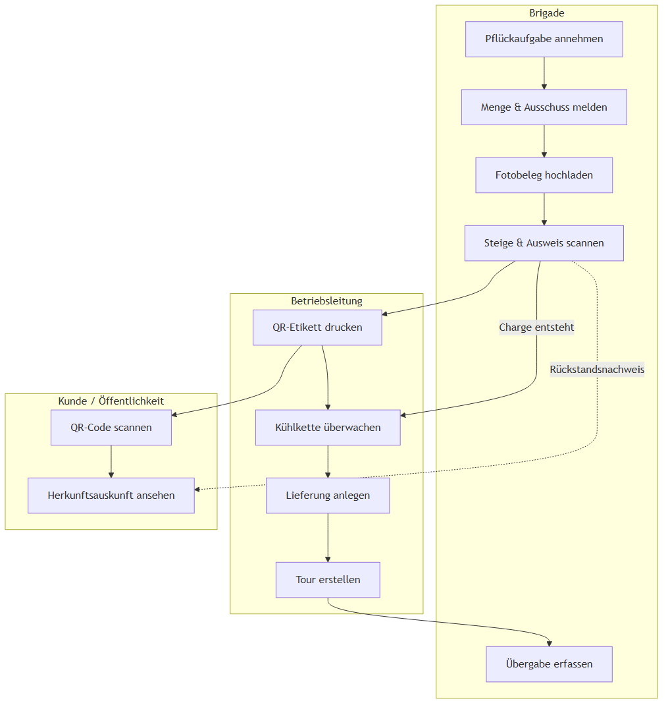
