# Prozess 2 — Von der Bestellung bis zur Gutschrift

Klickanleitung anhand der 12 Screenshots aus `docs/prozesse/bilder/`.

| # | Rolle | Seite (URL) | Klick / Eingabe | Ergebnis auf dem Bildschirm |
|---|---|---|---|---|
| 1 | Kunde | `/de/dashboard` | — | Kunden-Startansicht (allgemeine Zonen-Übersicht) |
| 2 | Kunde | `/de/dashboard/markt/b2b-portal` | — | Abschnitt „Preisliste" mit Preisen je Sorte |
| 3 | Kunde | dieselbe Seite | Sorte gewählt, Menge eingetragen | „Vorbestellung aufgeben" ausgefüllt, noch nicht gesendet |
| 4 | Kunde | dieselbe Seite | „Vorbestellung aufgeben" geklickt | Vorbestellung in der Liste, Status „angefragt" |
| 5 | Betriebsleitung | `/de/dashboard/markt/b2b-portal` | Cursor auf „Bestätigen" bei einer angefragten Vorbestellung | Vorbestellung in der Büro-Ansicht, Knopf „Bestätigen" / „Ablehnen" |
| 6 | Betriebsleitung | dieselbe Seite | — | Vorbestellung mit Status „bestätigt" |
| 7 | Kunde | `/de/dashboard/markt/b2b-portal` | — | Abschnitt „Meine Lieferungen" mit Status |
| 8 | Kunde | `/de/dashboard/markt/reklamationen` | Grund, Betreff, Beschreibung ausgefüllt | „Reklamation melden" ausgefüllt, noch nicht gesendet |
| 9 | Kunde | dieselbe Seite | „Reklamation melden" geklickt | Reklamation in der Liste, Status „offen" |
| 10 | Betriebsleitung | `/de/dashboard/markt/reklamationen` | Reklamation mit Status „In Prüfung" ausgewählt | Reklamationsdetail mit Feld „Verlauf" |
| 11 | Betriebsleitung | dieselbe Seite | Reklamation mit Status „Erledigt" ausgewählt | Detailansicht mit Feld „Gutschrift" und Lösungstext |
| 12 | Kunde | `/de/dashboard/markt/reklamationen` | — | Eigene Sicht auf die abgeschlossene Reklamation samt Gutschrift |

## Screenshots

### 1. Kunden-Dashboard
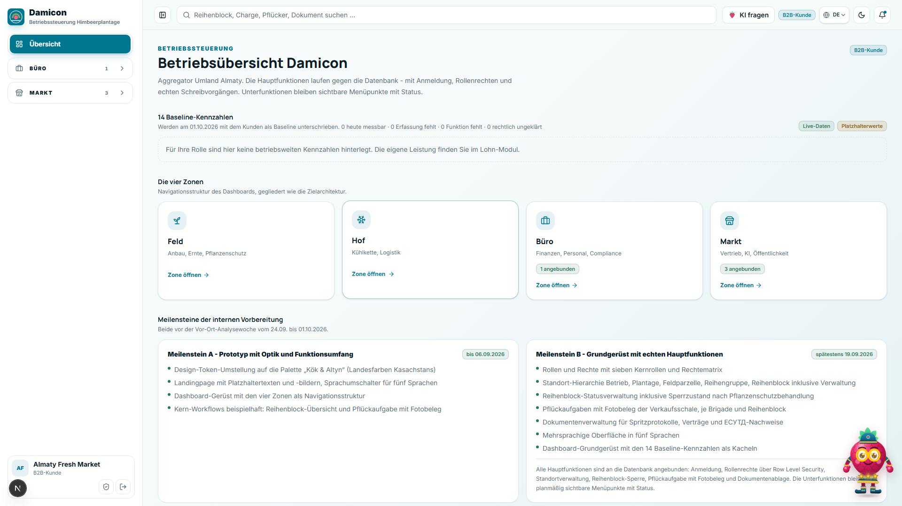

### 2. Preisliste
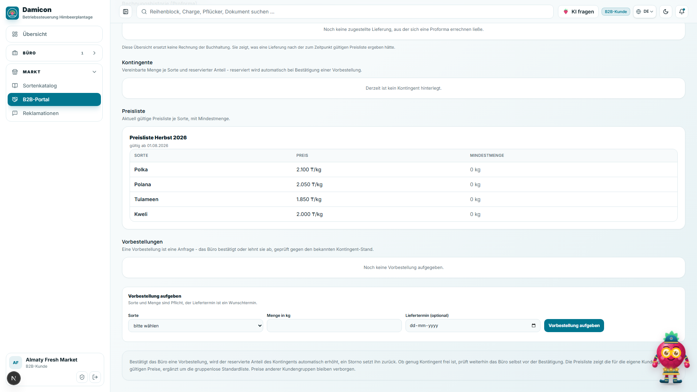

### 3. Vorbestellung-Formular
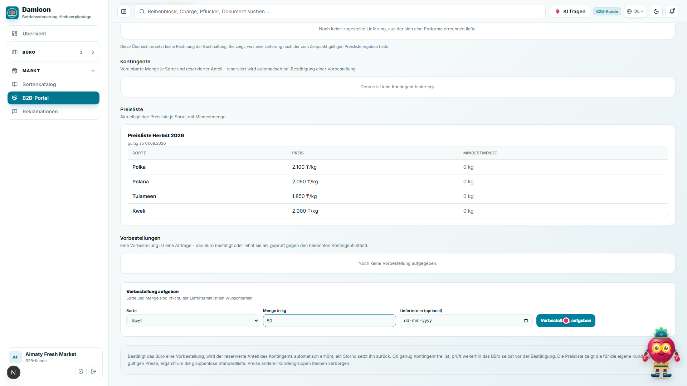

### 4. Vorbestellung offen
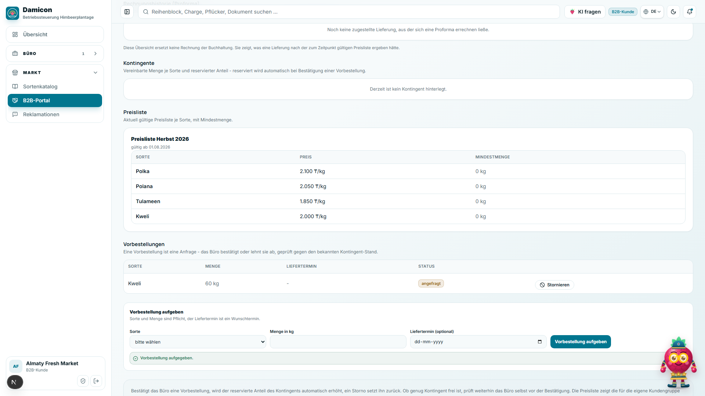

### 5. Vorbestellung bestätigen (Büro)

### 6. Vorbestellung bestätigt
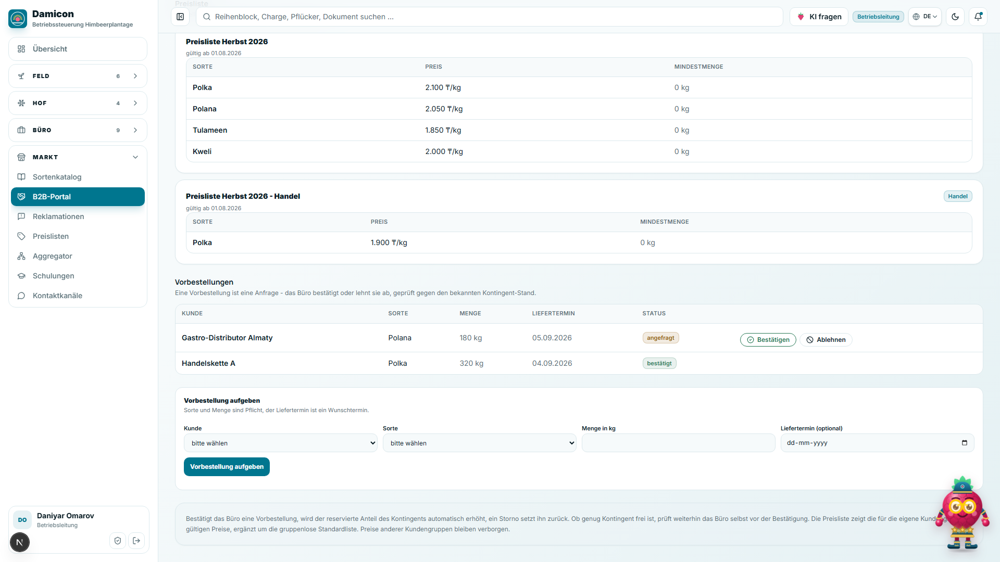

### 7. Meine Lieferungen
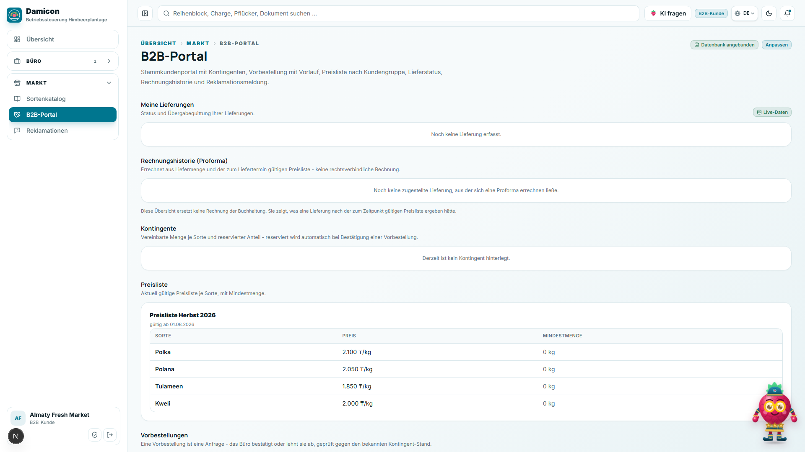

### 8. Reklamation-Formular
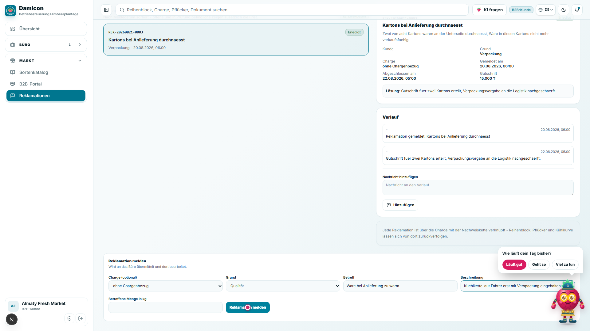

### 9. Reklamation gesendet
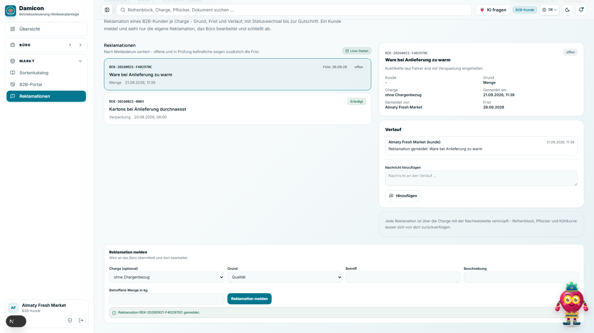

### 10. Reklamation-Verlauf (Büro)
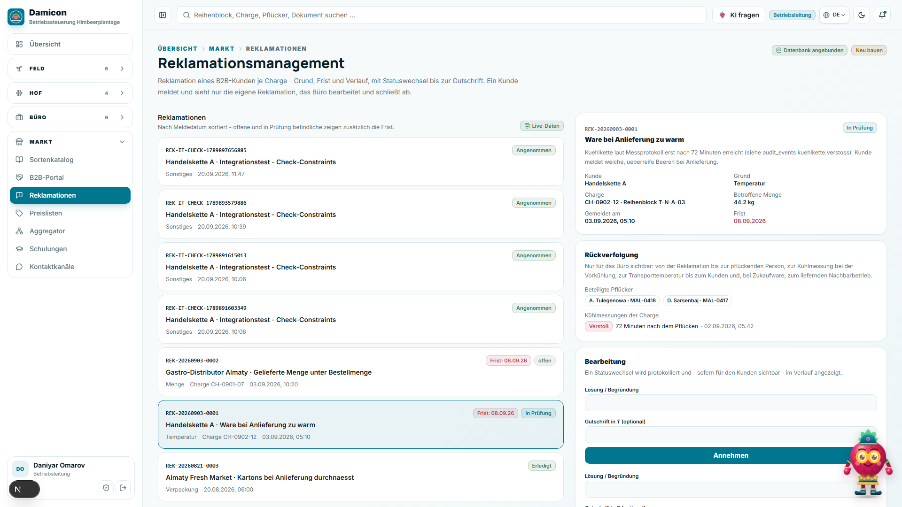

### 11. Gutschrift (Büro)
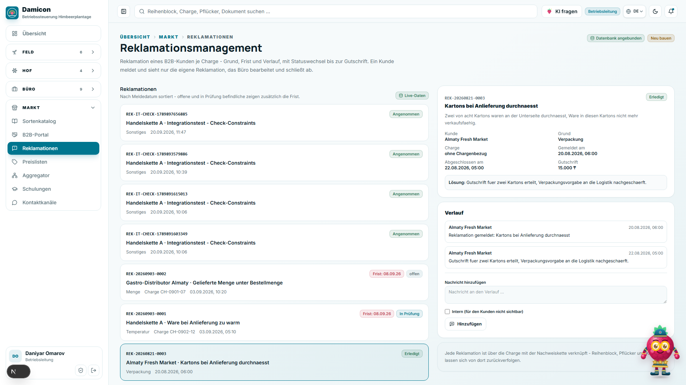

### 12. Reklamation aus Kundensicht
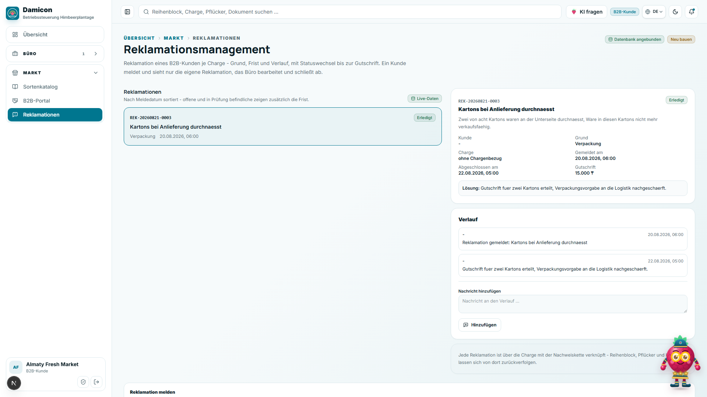

## Ablaufdiagramm

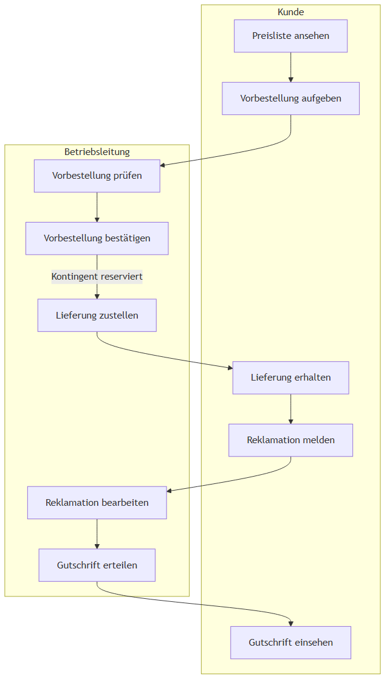
