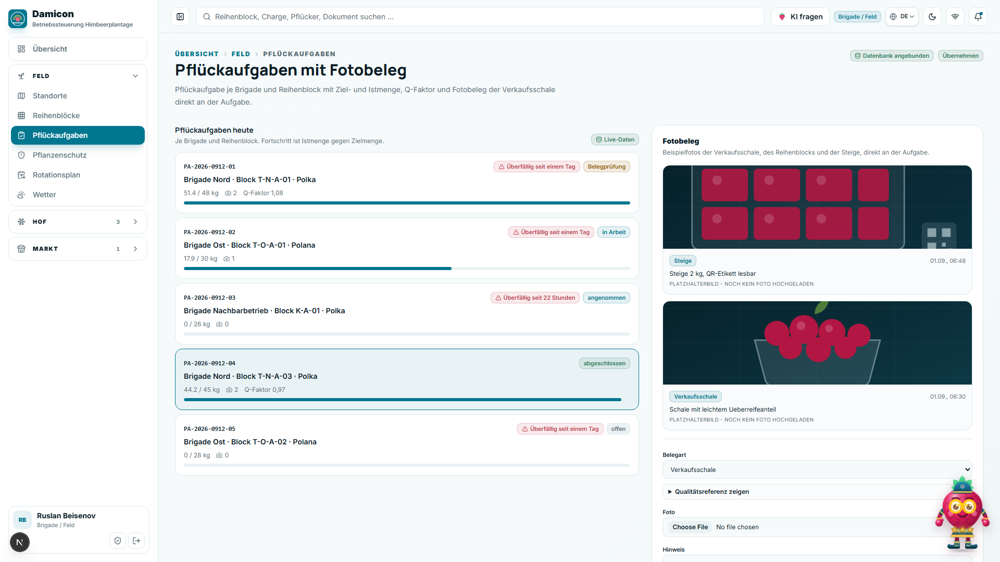
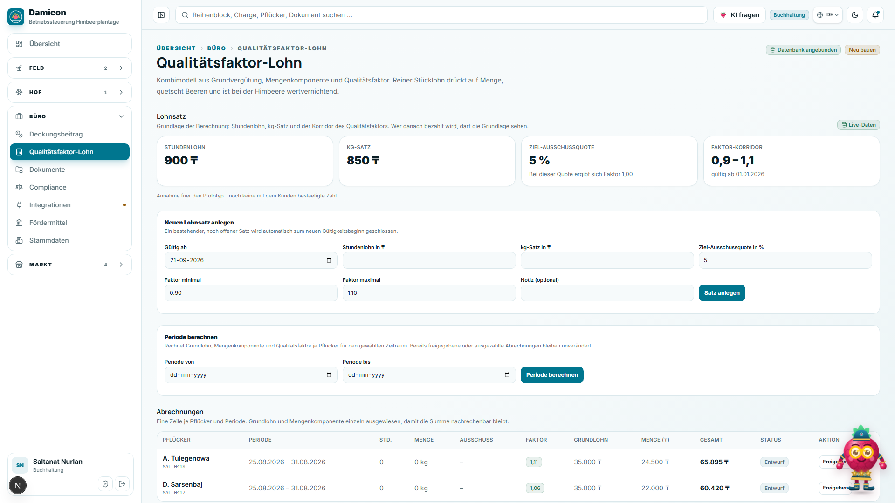
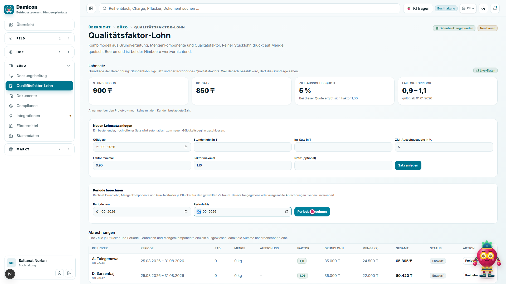
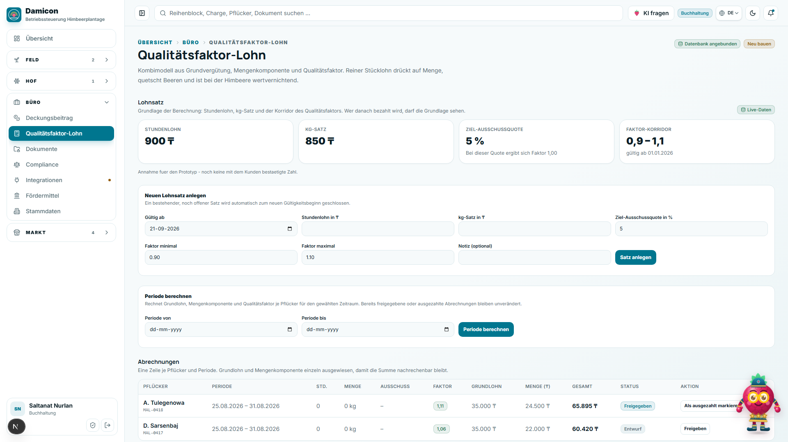
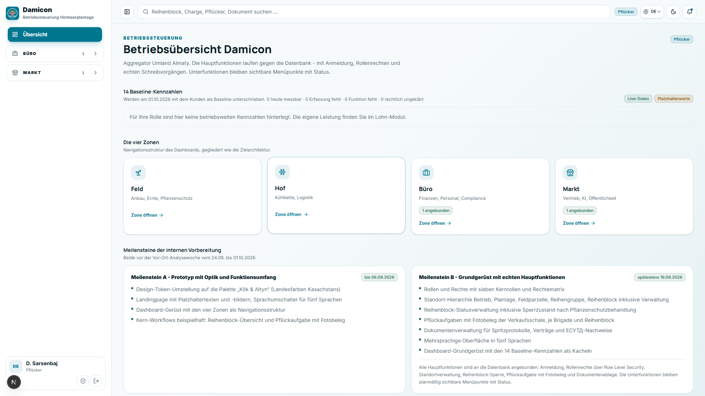
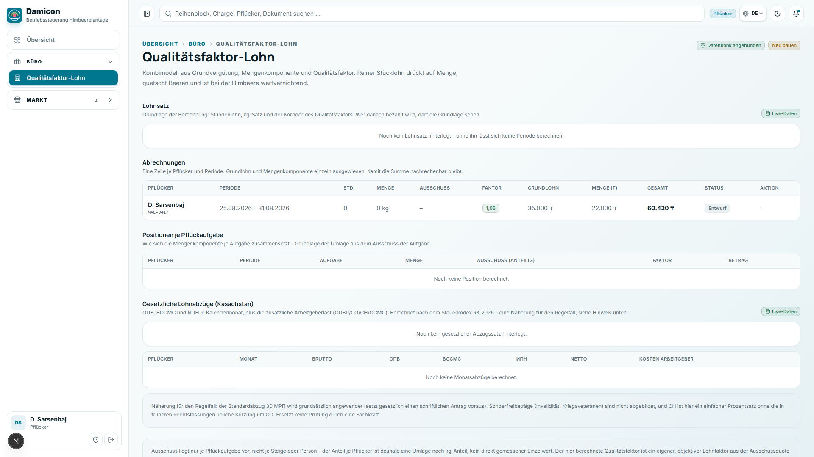
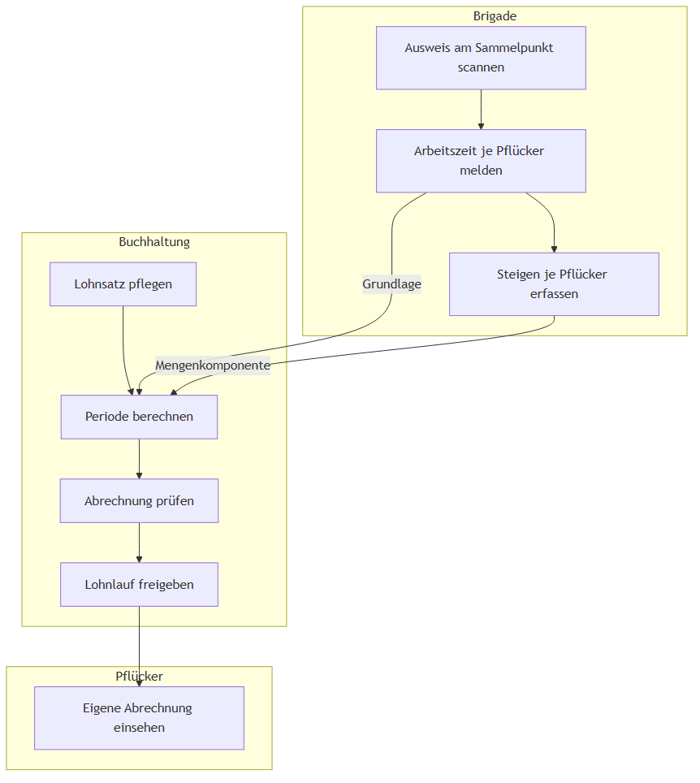

# Prozess 3 — Von der Arbeitszeit bis zum Lohn

Klickanleitung anhand der 8 Screenshots aus `docs/prozesse/bilder/`.

| # | Rolle | Seite (URL) | Klick / Eingabe | Ergebnis auf dem Bildschirm |
|---|---|---|---|---|
| 1 | Brigade | `/de/dashboard/feld/pflueckaufgaben?aufgabe=…` | — | Abschnitt „Nachweiskette": Arbeitszeit-Erfassung mit Ausweis-Scan |
| 2 | Brigade | dieselbe Seite | — | „Steigen mit Person": erfasste Steigen je Pflücker |
| 3 | Buchhaltung | `/de/dashboard/buero/lohn` | — | Abschnitt „Lohnsatz": Stundenlohn, kg-Satz, Faktor-Korridor |
| 4 | Buchhaltung | dieselbe Seite | „Periode von" / „Periode bis" ausgefüllt | „Periode berechnen" ausgefüllt, noch nicht gestartet |
| 5 | Buchhaltung | dieselbe Seite | — | Tabelle „Abrechnungen": berechnete Zeile je Pflücker, Status „Entwurf" |
| 6 | Buchhaltung | dieselbe Seite | „Freigeben" bei einer Entwurf-Zeile geklickt | Status „Freigegeben", Aktion wechselt zu „Als ausgezahlt markieren" |
| 7 | Pflücker | `/de/dashboard` | — | Pflücker-Startansicht mit wenigen Menüpunkten |
| 8 | Pflücker | `/de/dashboard/buero/lohn` | — | Tabelle „Abrechnungen" zeigt ausschließlich die eigene Zeile |

## Screenshots

### 1. Arbeitszeit-Erfassung

### 2. Steigen je Pflücker

### 3. Lohnsätze

### 4. Lohnperiode berechnen

### 5. Lohn-Ergebnis

### 6. Lohnlauf freigegeben

### 7. Pflücker-Dashboard

### 8. Eigener Lohn

## Ablaufdiagramm

