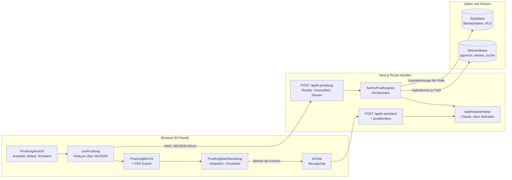
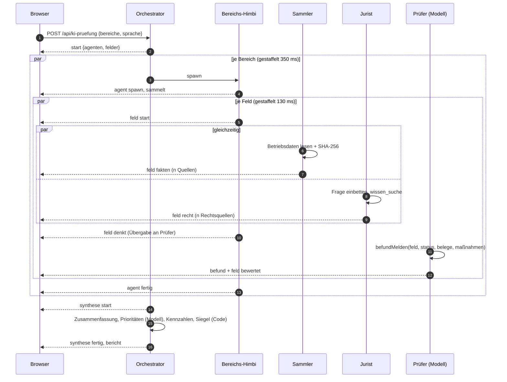
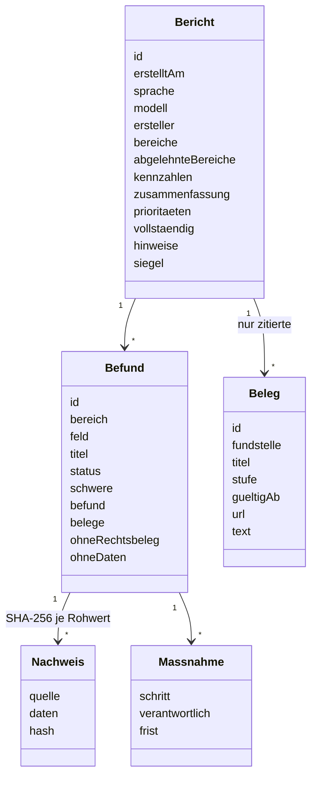
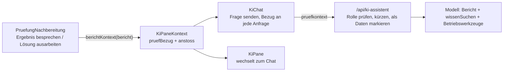

# Compliance-Prüfung: Entwurf und Umsetzung

| | |
| --- | --- |
| **Gegenstand** | Mehrstufige, belegte Compliance-Prüfung des Betriebs (Audit, Steuer, Recht, Risiko) durch zusammenarbeitende KI-Agenten, mit Bericht (PDF), Gespräch zum Ergebnis und Maßnahmen-Checkliste |
| **Stand** | 2026-09-20, Pull Request #92 (Feinschliff) auf Grundlage von #85 (Panel-Ansicht), #89 (Ausfallsicherheit, PDF) |
| **Code** | `src/lib/pruefung/*`, `src/components/pruefung/*`, `src/app/api/ki-pruefung/route.ts`, `src/lib/text/umlaute.ts` |
| **Verwandt** | [Wissensbasis in Supabase](wissensbasis-supabase.md), [KI-Ausfallsicherheit](ki-ausfallsicherheit.md), [Agent-Architektur](architecture/README.md) |
| **Leser** | Entwicklung, Betrieb, Auditoren, Projektleitung |

## Inhalt

1. [Ziel und Abgrenzung](#1-ziel-und-abgrenzung)
2. [Architektur im Überblick](#2-architektur-im-überblick)
3. [Das Agentenmodell](#3-das-agentenmodell)
4. [Audit-Festigkeit: was nicht das Modell entscheidet](#4-audit-festigkeit-was-nicht-das-modell-entscheidet)
5. [Datenmodell und Ereignisprotokoll](#5-datenmodell-und-ereignisprotokoll)
6. [Zugriff und Sicherheit](#6-zugriff-und-sicherheit)
7. [Oberfläche im KI-Panel](#7-oberfläche-im-ki-panel)
8. [Der Bericht als PDF](#8-der-bericht-als-pdf)
9. [Gespräch zum Ergebnis und Checkliste](#9-gespräch-zum-ergebnis-und-checkliste)
10. [Sprache und Umlaute](#10-sprache-und-umlaute)
11. [Fehlerverhalten](#11-fehlerverhalten)
12. [Leistung und Kosten](#12-leistung-und-kosten)
13. [Tests und Nachweise](#13-tests-und-nachweise)
14. [Betrieb](#14-betrieb)
15. [Entscheidungen](#15-entscheidungen)
16. [Grenzen und offene Punkte](#16-grenzen-und-offene-punkte)

---

## 1. Ziel und Abgrenzung

**Ziel.** Eine Person mit Prüfrecht löst mit einem Klick eine Compliance-Prüfung aus. Ein Team aus KI-Agenten trägt die Betriebsdaten und die einschlägigen Rechtsquellen zusammen, bewertet jedes Prüfungsfeld und liefert einen Bericht, in dem **jede rechtliche Aussage belegt** ist. Die Person sieht dabei in Echtzeit, wie die Agenten arbeiten und einander die Arbeit übergeben, kann den Bericht als PDF an Behörden, Steuerberater oder Prüfer weitergeben, das Ergebnis mit dem Assistenten besprechen und die Lücken mit einer Checkliste abarbeiten.

**Leitgedanken**

- *Kein Beleg, keine Behauptung.* Ohne gültige Rechtsquelle aus diesem Prüfungsfeld und ohne Betriebsdaten wird ein Befund zum Hinweis herabgestuft.
- *Jeder Lauf prüft dasselbe.* Das Prüfprogramm steht im Code, nicht im Modell. Ein "ohne Befund" ist nur dann etwas wert, wenn jeder Lauf dieselben Punkte abdeckt.
- *Das Modell schreibt, der Code entscheidet.* Das Modell liest Daten gegen Rechtstexte und formuliert. Ob ein Befund gilt, welche Kennzahlen sich ergeben und was versiegelt wird, entscheidet deterministischer Code.
- *Das Hauptfenster bleibt frei.* Der gesamte Ablauf läuft im KI-Panel, nichts blockiert die Anwendung.

**Nicht-Ziele.** Keine Rechtsberatung und kein Ersatz für Steuerberater oder Anwalt (der Bericht sagt das ausdrücklich). Keine automatische Behebung von Verstößen. Kein Speichern der Berichte auf dem Server (siehe [Grenzen](#16-grenzen-und-offene-punkte)).

---

## 2. Architektur im Überblick

**Ablauf in einem Satz.** Der Browser ruft die Route auf und liest einen Strom von JSON-Zeilen. Die Route prüft Recht und Gesundheit, der Orchestrator startet je Prüfungsfeld ein Team, jedes Team meldet seine Schritte als Ereignisse, am Ende steht ein versiegelter Bericht. Alles danach (PDF, Gespräch, Checkliste) arbeitet nur mit diesem Bericht im Browser.

**Warum ein Strom und keine Abfrage.** Ein Lauf dauert 20 bis 40 Sekunden. Als Strom (`application/x-ndjson`, `no-store`, `no-transform`) sieht die Person jeden Schritt sofort. Ein Abbruch des Clients bricht den Lauf serverseitig ab (`req.signal`).

---

## 3. Das Agentenmodell

Es gibt **18 Agenten** bei einer Vollprüfung: Himbi (Orchestrator), 4 Bereichs-Himbis und 13 Prüfer (einer je Prüfungsfeld). Zu jedem Prüfer gehören zwei **Helfer** (Sammler und Jurist), die keine Modellaufrufe sind, sondern Code.

| Rolle | Anzahl | Aufgabe | Modellaufruf |
| --- | --- | --- | --- |
| **Himbi** (Orchestrator) | 1 | plant, startet die Bereiche, führt am Ende zusammen (Zusammenfassung, Prioritäten) | ja, einmal am Ende |
| **Bereichs-Himbi** | 4 | leitet die Felder seines Bereichs, meldet Start, Übergabe und Ende | nein |
| **Sammler** | 13 | liest die Betriebsdaten aus der Datenbank (die Lesewerkzeuge der Rolle, direkt aufgerufen, mit SHA-256 je Rohwert) | nein |
| **Jurist** | 13 | sucht die Rechtsquellen zum Feld in der Wissensbasis (deutsche Frage plus russische Fachbegriffe) | nein (Einbettung und Suche) |
| **Prüfer** | 13 | liest Daten gegen Rechtsquellen, meldet den Befund über das Werkzeug `befundMelden` | ja, je Feld einer |

**Parallelität.** Alle Felder laufen gleichzeitig; nur der Start ist gestaffelt (130 ms je Feld, 350 ms je Bereich), damit die Übergaben sichtbar nacheinander beginnen. Gemessen mit echtem Claude: eine Vollprüfung in etwa 30 Sekunden, davon der größte Teil der längste einzelne Prüfer plus die Zusammenfassung. Vorher (ein Aufruf je Bereich, alle Felder nacheinander im Prompt) waren es 35 Sekunden und mehr, weil ein Bereich so lange dauerte wie alle seine Felder zusammen.

**Ausfall bleibt lokal.** Jedes Team ist für sich abgesichert:

1. Der Prüfer bekommt zwei Versuche (`toolChoice: required`, ein Schritt). Liefert das Modell das Feld nicht, wird einmal gezielt nachgefragt.
2. Bleibt es dabei ohne Fehler: das Feld wird ehrlich als "nicht bewertet" geführt (Hinweis, `ohneRechtsbeleg`), der Bericht als unvollständig markiert.
3. Enden beide Versuche mit einem **Fehler**, gilt nur dieses Team als ausgefallen. Nur wenn **alle** Felder eines Bereichs mit Fehler enden, gilt der Bereich als ausgefallen (`agent fehler`).

---

## 4. Audit-Festigkeit: was nicht das Modell entscheidet

| Entscheidung | Wer | Wo |
| --- | --- | --- |
| **Was** geprüft wird (13 Felder, Fragen, russische Suchbegriffe, Datenquellen) | Code | `felder.ts` |
| Zusammentragen der Betriebsdaten | Code | `agenten.ts` (`sammle`) |
| Wissenssuche je Feld | Code (nicht vom Modell "gewollt") | `agenten.ts` (`sammle`) |
| Ob ein Befund gilt | Code | `befund.ts` (`pruefeBefund`) |
| Kennzahlen, Reife, Stufe | Code | `befund.ts` (`kennzahlen`) |
| Maßnahmenplan (Reihenfolge nach Frist und Schwere) | Code | `befund.ts` (`massnahmenplan`) |
| Siegel (SHA-256 über kanonisches JSON) | Code | `befund.ts` (`siegelFuer`) |
| Text der Befunde, Zusammenfassung, Prioritäten | Modell | `agenten.ts` |

**Regeln in `pruefeBefund`**

- Belegkennungen (`S12`), die nicht aus **diesem** Feld stammen, fallen weg (erfundene Kennungen werden gestrichen).
- `verstoss`, `luecke` und `konform` gelten nur mit mindestens einer gültigen Rechtsquelle, sonst wird der Befund zum `hinweis` mit `ohneRechtsbeleg`.
- Ohne Betriebsdaten zum Feld ist nur ein `hinweis` möglich (`ohneDaten`). Eine Aussage über den Betrieb ohne Daten wäre geraten.
- Ein Hinweis ist nie `kritisch` oder `hoch`; `konform` hat Schwere `keine` und keine Maßnahmen.

**Prüfungsreife (0 bis 100).** Start bei 100, Abzug nur für **belegte** Verstöße und Lücken nach Schwere (kritisch 25, hoch 12, mittel 5, niedrig 2), je Hinweis 1 Punkt. Stufen: ab 85 *prüfungsbereit*, ab 60 *mit Lücken*, darunter *nicht prüfungsreif*. Das Modell schätzt die Reife nicht.

**Siegel.** SHA-256 über die kanonische JSON-Form des gesamten Berichtsinhalts (Schlüssel sortiert, ohne `undefined`). Dieselbe Funktion läuft im Browser für "Siegel prüfen": jede nachträgliche Änderung an Befund, Reife oder zitiertem Gesetzestext macht das Siegel ungültig. Die Sprachkorrektur (Umlaute) geschieht **vor** dem Siegeln.

---

## 5. Datenmodell und Ereignisprotokoll

### Bericht (`typen.ts`)

Der Bericht trägt alle **zitierten** Rechtsquellen im Wortlaut mit. Er ist damit auch ohne Wissensbasis lesbar und prüfbar. Beschriftungen der Quellen (Titel, Fundstelle) werden in der Berichtssprache geschrieben, der **Wortlaut** der Rechtstexte bleibt unverändert.

### Ereignisse (NDJSON, eine JSON-Zeile je Ereignis)

| Ereignis | Bedeutung |
| --- | --- |
| `start` | Lauf-ID, Rolle, Agenten mit ihren Feldern (Titel in der Berichtssprache), abgelehnte Bereiche |
| `agent` | Phase des Bereichs-Himbis: `spawn`, `sammelt`, `denkt` (erste Übergabe), `fertig`, `fehler` |
| `feld` | Phase eines Feld-Teams: `start`, `fakten` (Sammler fertig), `recht` (Jurist fertig), `denkt` (Übergabe an den Prüfer), `bewertet` |
| `befund` | ein fertiger Befund |
| `synthese` | `start` und `fertig` der Zusammenführung |
| `bericht` | der versiegelte Bericht und ob das Audit-Protokoll geschrieben wurde |
| `fehler` | allgemeiner Fehler |

Der Reducer im Browser (`use-pruefung.ts`) macht aus jedem Ereignis genau eine Zustandsänderung; Zeitstempel kommen mit der Aktion, damit der Reducer rein bleibt. Fehlt am Ende der `bericht`, meldet die Oberfläche einen Fehler statt eines leeren Berichts.

---

## 6. Zugriff und Sicherheit

**Rollen** (serverseitig erzwungen, die Oberfläche blendet nur aus):

| Rolle | Bereiche |
| --- | --- |
| Administration | Audit, Steuer, Recht, Risiko (Vollprüfung) |
| Buchhaltung | Audit, Steuer |
| Betriebsleitung | Recht, Risiko |
| alle anderen | keine Prüfung |

**Route `/api/ki-pruefung`**

| Status | Bedeutung |
| --- | --- |
| 401 | nicht angemeldet |
| 403 | fehlendes Recht `ki_assistent` oder kein Prüfrecht, oder keiner der angefragten Bereiche freigegeben |
| 400 | ungültige Eingabe |
| 409 | Wissensbasis nicht erreichbar (kein Audit ohne Belege) oder kein KI-Anbieter |
| 429 | für diese Person läuft bereits eine Prüfung (ein Lauf je Person) |
| 200 | Strom, `maxDuration` 300 s |

Angefragte, aber nicht freigegebene Bereiche werden **nicht ausgeführt** und im Bericht genannt. Betriebsdaten kommen nur über die Lesewerkzeuge der Rolle: was die Rolle nicht sehen darf, sieht auch die Prüfung nicht (Zeilensicherheit der Datenbank gilt).

**Audit-Protokoll.** Start und Ende werden festgehalten (`compliance_pruefung_gestartet`, `compliance_pruefung_abgeschlossen`), samt Vollständigkeit und den Anbieterwechseln des Laufs.

**Kontext im Chat.** Der Bericht geht als Text im Feld `pruefkontext` an `/api/ki-assistent`. Die Route nimmt ihn **nur für Rollen mit Prüfrecht** an, entfernt Steuerzeichen, kürzt auf 14 000 Zeichen und setzt ihn zwischen die Marken `BERICHT-ANFANG` und `BERICHT-ENDE` mit der ausdrücklichen Regel, dass der Text **Daten und keine Anweisungen** sind (Schutz vor eingeschleusten Befehlen). Fundstellen stehen im Klartext, Berichtskennungen (`S12`) werden nie als Zitatmarke benutzt, damit sie nicht mit den Zitaten der laufenden Wissenssuche verwechselt werden.

**Prompt-Schutz beim Prüfer.** Die Wissenssuche und die Betriebsdaten werden dem Prüfer als Daten gegeben; er sucht nichts selbst und darf nur `befundMelden` aufrufen. Werkzeug-Eingaben werden mit Zod geprüft (`befundEingabe`).

---

## 7. Oberfläche im KI-Panel

Die Prüfung ist eine **Ansicht des Panels** (ShieldCheck-Knopf), kein Fenster über der Anwendung. Sie bleibt eingebunden, auch wenn zum Chat gewechselt wird; ein laufender Lauf geht nicht verloren. Das Panel wird für diese Ansicht vorübergehend breiter (höchstens 600 px, das Hauptfenster behält 680 px), ohne die gespeicherte Breite zu überschreiben.

| Baustein | Inhalt |
| --- | --- |
| **Himbi-Karte** | Orchestrator mit Text ("0 von 4 Mini-Himbis fertig"), Zahlen (Agenten, Befunde, Quellen, Zeit) und Protokollfeed (letzte drei Zeilen, u. a. die Übergaben) |
| **Schwarm** | alle Mini-Himbis auf einen Blick: je Bereich eine Zeile, je Feld ein Chip mit drei Stationen (Sammler, Jurist, Prüfer). Sammler und Jurist leuchten gleichzeitig, bei der Übergabe springt die Prüfer-Station an. Fertige Chips zeigen den Status (Verstoß rot, Lücke gelb, Hinweis grau, konform grün) |
| **Spuren** | je Bereich eine ausklappbare Spur mit den Feldern, drei Schritten je Feld und der zuerst gefundenen Fundstelle; fertige Spuren feiern kurz und klappen zu |
| **Zusammenführen** | Balken und Text, solange Himbi zusammenführt |
| **Nächste Schritte** | Gespräch und Checkliste (siehe Abschnitt 9) |
| **Bericht** | Reifegrad, Prioritäten, Befunde mit Zitatmarken und Quellenkarten, Maßnahmenplan, Siegel, Export |

**Gestaltungsregeln.** Alles im normalen Fluss (Grid), nichts liegt absolut über anderem; bewegt werden nur `transform` und `opacity`; alle Farben aus den Theme-Variablen; Container Queries statt Fensterbreiten; `prefers-reduced-motion` schaltet Animationen ab; Gitterzellen dürfen schrumpfen, damit lange Texte das schmale Panel nicht sprengen.

---

## 8. Der Bericht als PDF

Der Bericht wird als eigenes A4-Dokument gebaut (`bericht-pdf.ts`) und über den Druckdialog des Browsers als PDF gespeichert. Der Titel des Dokuments ist der vorgeschlagene Dateiname (`Compliance-Prüfbericht-<Datum>-<ID>`). Bewusst **kein PDF-Baukasten**: der Browser bringt Schriften für Kyrillisch und Kasachisch mit, ein Baukasten müsste Schriften ausliefern und den Zeilenumbruch nachbauen.

| Seite | Inhalt |
| --- | --- |
| **Deckblatt** (ohne Seitenrand) | Damicon-Bildmarke (Sonnensiegel, dieselben Strahlen wie `DamiconLogo`), Schriftzug, Stempel *Vertraulich*, Dokumentart, Titel, geprüfte Bereiche, **Reifegrad-Ring** mit Urteil und Zusammenfassung, Eckdaten (Berichtsnummer, Erstellungszeit, Ersteller mit Rolle, Prüfumfang, Modell), **Inhaltsverzeichnis**, Siegel in der Fußleiste |
| **1** Zusammenfassung | Gesamtlage |
| **2** Ergebnis nach Bereich | Tabelle je Bereich (Felder, Verstoß, Lücke, Hinweis, konform) mit Legende und Reifestufen |
| **3** Wichtigste Schritte | die drei Prioritäten |
| **4** Befunde | nummerierte Karten mit Status, Schwere, Bereich, Text, Rechtsgrundlage, Betriebsdaten mit Prüfsumme, Maßnahmen |
| **5** Maßnahmenplan | Tabelle nach Frist, mit Verantwortlichen und Priorität |
| **6** Methodik und Prüfumfang | wie geprüft wurde (Teams, Belegpflicht, Berechnung der Reife) |
| **7** Anhang | zitierte Rechtsquellen im Wortlaut (auch Russisch), mit Stufe, Sprache, Stand, Link |
| **8** Freigabe | drei Unterschriftsfelder (Betriebsleitung, Buchhaltung, externe Prüfung) mit Ort und Datum |
| **9** Siegel und Nachweis | Berichts-ID, Zeitpunkt, Modell, Prüfsumme, Hinweis zur Verifikation, Einschränkungen, Haftungshinweis |

**Kopf- und Fußzeile** (ab Seite 2) laufen über `@page`-Randfelder: links Bildmarke, Mitte "Damicon · Compliance-Prüfbericht", rechts Berichtsnummer; unten Vertraulichkeitsvermerk und **Seite x von y**. Das Deckblatt hat keine Ränder und keine Randfelder (`@page :first`). Chromium-Browser (Chrome, Edge) zeigen sie; andere Browser drucken denselben Inhalt mit ihrer eigenen Kopf- und Fußzeile. Im Druckdialog "Kopf- und Fußzeilen" ausschalten (steht auch als Tipp im Bericht).

**Sicherheit des Dokuments.** Jeder Text aus dem Bericht wird maskiert (`esc`), es gibt kein Skript im Dokument; das Dokument läuft in einem unsichtbaren Rahmen, das Panel bleibt unberührt. Zusätzlich lässt sich die **prüfbare JSON-Datei** speichern, mit der das Siegel nachgerechnet werden kann. Alle Texte des PDFs gibt es in Deutsch, Englisch, Russisch und Kasachisch (`pruefungPdf`).

**Verifikation im Entwurf.** Das PDF wurde real gedruckt (Edge) und seitenweise als Bild geprüft: Deckblatt, Kopfzeile, Fußzeile, Seitenzahlen, Tabellen und Freigabeseite.

---

## 9. Gespräch zum Ergebnis und Checkliste

Beides steht **außerhalb** des versiegelten Berichts: der Bericht bleibt unverändert, die Werkzeuge daneben sind Arbeitsmittel.

### Gespräch

- Der Bezug (`pruefBezug`: ID und Kontexttext) liegt im Panel-Kontext und in `sessionStorage`; er überlebt ein Neuladen, aber nicht die Sitzung. Ein **Bezugschip** über dem Eingabefeld zeigt "Bezug: Prüfbericht <ID>" und lässt sich entfernen.
- Der Assistent erklärt Befunde, Schweregrade und Maßnahmen auf Grundlage des Berichts, zieht für **neue** Rechtsaussagen die Wissensbasis heran (mit Fundstellen) und erfindet nichts, was weder im Bericht noch in der Suche steht. Betriebsdaten kann er zusätzlich live abfragen.
- Die Fragen ("Erkläre mir dieses Prüfergebnis", "Lösungsplan", "Wie setze ich diese Maßnahme um") sind in allen vier Sprachen hinterlegt; die Antwort kommt in der Sprache der Frage.

### Checkliste (`checkliste.ts`)

Rein aus dem Bericht abgeleitet, ohne Modell: sie ist sofort da und jeder Punkt führt auf einen Befund und dessen Rechtsgrundlage zurück.

- Aus jeder **Maßnahme** eines Verstoßes oder einer Lücke ein Punkt, aus jedem **Hinweis ohne Maßnahme** ein Prüfauftrag ("Prüfen und Nachweise ergänzen", Frist 30 Tage, verantwortlich nach Bereich).
- Ordnung nach Frist (sofort, 7, 30, 90 Tage), dann Schwere. Gruppen mit Zähler, Fortschrittsbalken, "n von m erledigt".
- Der Stand liegt im Browser je Bericht (`localStorage`, Schlüssel `damicon-checkliste-<Berichts-ID>`), damit man an einem anderen Tag weitermacht.
- Je Punkt öffnet "Lösung ausarbeiten" den Chat mit einer konkreten Frage zu genau diesem Punkt (Schritte, Nachweise, Rechtsgrundlage).

---

## 10. Sprache und Umlaute

Anforderung: Bei deutscher Oberfläche nirgends Ersatzschreibung (ae, oe, ue, ss statt ä, ö, ü, ß); jeder Bericht und jede Antwort in **einer** Sprache.

| Schicht | Maßnahme |
| --- | --- |
| **Quelltexte** | deutsche Sätze in Prompts, Werkzeugbeschreibungen, Meldungen und Feldtiteln mit Umlauten (Codemod über Zeichenketten mit Leerzeichen; Abfragen, Klassen, Kennungen ausgenommen) |
| **Prompts** | `LANGUAGE`-Zeile verlangt die Berichtssprache ohne Mischung und für Deutsch echte Umlaute |
| **Modellausgabe** | `mitUmlauten()` auf Titel, Befund, Maßnahmen, Zusammenfassung und Prioritäten **vor dem Siegeln** |
| **Beschriftung der Quellen** | Titel und Fundstelle werden normalisiert, der Wortlaut des Rechtstextes nicht |
| **Feste Berichtssätze** | je Sprache in `agenten.ts` (`TEXTE`: de, en, ru, kk), damit ein englischer Bericht kein deutsches Wort enthält |
| **Feldtitel** | je Sprache in `felder-titel.ts`, Server (Ersatzbefund, Hinweise) und Oberfläche nutzen dieselbe Quelle |
| **Chat-Anzeige** | Markdown-Text läuft durch `mitUmlauten()` (Code, Adressen, Kennungen bleiben unberührt) |
| **Werkzeugeingaben** | `ohneUmlaute()` normalisiert Tabellen-, Spalten- und Suchbegriffe (die Namen sind ASCII: `pfluecker`, `kuehlketten_messungen`) |

**`src/lib/text/umlaute.ts`.** Ein blindes "ue" zu "ü" würde *Steuer*, *Feuer* und *neue* zerstören. Deshalb gibt es eine **kuratierte Liste von Wortstämmen**, die in korrektem Deutsch nie in Ersatzschreibung vorkommen (`pruef`, `kuehl`, `faell`, `itaet` ...), plus Wörter, die nur am Wortanfang oder ganz gelten (`ueber`, `fuer`, `gross`), und `loes` nur vor bekannten Endungen (Lösung, lösen). Geschützt sind Codeabschnitte, Adressen und Kennungen (Pfade, `snake_case`, `camelCase`, Dateinamen). Die Funktion ist idempotent, für Russisch, Kasachisch und Englisch wirkungslos und mit einem Wortspeicher schnell (180 KB in unter 20 ms).

---

## 11. Fehlerverhalten

| Störung | Verhalten | Sichtbar für die Person |
| --- | --- | --- |
| Wissensbasis nicht erreichbar | Route lehnt ab (409), kein Audit ohne Belege | Hinweis "Wissensbasis nicht verfügbar" |
| Wissenssuche fällt für ein Feld aus | Feld ohne Rechtsquellen: nur Hinweis, Ausfall im Bericht vermerkt | Einschränkung im Bericht |
| Kein Lesewerkzeug für die Rolle | Felder ohne Betriebsdaten: nur Hinweise (`ohneDaten`) | Hinweis je Feld |
| Modell lässt ein Feld aus | einmal gezielt nachfragen, dann "nicht bewertet" | Bericht unvollständig |
| Modell wirft Fehler für ein Feld | dieses Team fällt aus, Rest liefert | Feld "nicht bewertet" |
| Modell wirft Fehler für alle Felder eines Bereichs | Bereich `fehler` | Spur "ausgefallen", Hinweis im Bericht |
| Zusammenfassung scheitert (zwei Versuche) | Kennzahlentext statt Modelltext | Hinweis "ohne Modell erstellt" |
| Anthropic: Guthaben leer, Ratenlimit, Überlast | Kette wechselt zu Sokrates-Qwen (siehe [Ausfallsicherheit](ki-ausfallsicherheit.md)) | Wechsel im Audit-Protokoll |
| Client bricht ab | Lauf wird abgebrochen, keine Schreibvorgänge | Panel zurück auf Auswahl |
| Zweiter Start derselben Person | 429 | Hinweis "läuft bereits" |

---

## 12. Leistung und Kosten

- **Modellaufrufe je Vollprüfung:** 13 Prüfer plus 1 Zusammenfassung (vorher 4 plus 1). Bei einem Fehler je Feld bis zu 2 Versuche.
- **Dauer** (lokal gemessen, belasteter Rechner, echtes Claude Haiku): etwa 30 Sekunden. Das Ende bestimmt der langsamste Prüfer plus die Zusammenfassung.
- **Token je Prüfer:** System-Prompt (klein), Daten (bis 3 500 Zeichen je Quelle) und bis 4 Rechtsquellen zu je 900 Zeichen: grob 2 000 bis 3 000 Eingabe-Token je Aufruf.
- **Ratenlimits.** 13 gleichzeitige Aufrufe erzeugen einen Schub. Bei niedriger Anthropic-Stufe kann das ein Limit auslösen; die Kette klassifiziert das als `ratenlimit` und weicht aus. Die Stufe des Kontos sollte zur Nutzung passen.
- **Wissenssuche.** je Feld ein Aufruf (Einbettung plus `wissen_suche`); 13 Suchen laufen parallel, die Datenbankfunktion braucht etwa 60 bis 80 ms.

---

## 13. Tests und Nachweise

| Suite | Prüfungen | Deckt ab |
| --- | --- | --- |
| `npm run test:pruefung` | 87 | Rollen und Bereichswahl, `pruefeBefund` (Herabstufung, erfundene Kennungen), Kennzahlen, Siegel (Manipulation), Sub-Agenten (ein Aufruf je Feld, Reihenfolge start, Sammler und Jurist, Übergabe, bewertet; Gleichzeitigkeit), Teamausfall, Nachfrage, Bereichsausfall, Zusammenfassung (Wiederholung, Kürzung), feste Sätze je Sprache, Umlaute in Modellausgabe und Quellenbeschriftung, PDF (Deckblatt, Kopf und Fuß, Inhaltsverzeichnis, Freigabe, vier Sprachen ohne fehlenden Text, Maskierung), Kontext, Checkliste, Route und Chat-Route |
| `npm run test:umlaute` | 35 | Umwandlung, Schutz von *Steuer*, *Feuer* und Co., Code, Adressen, Kennungen, fremde Sprachen, Idempotenz, Tempo |
| `npm run test:agent` | 77 | Agent-Abdeckung, Prompts (Quelltexte werden gegen die ASCII-Kennungen geprüft) |
| `npm run test:ausfall` | 36 | Anbieterkette und Schutzschalter |
| `npm run test:wissen-backend` | 44 | Wissensbasis-Backend und Gesundheitsprobe |
| `npm test` | alle | gesamte Kette inkl. Datenbanktests, grün |

Zusätzlich manuell mit Produktions-Build: echter Lauf mit Claude (18 Agenten, 13 Befunde, 52 Quellen in etwa 29 s), abgespielter Strom für Schwarm und Übergaben, Checkliste (Abhaken, Fortschritt), Chat mit Bezug (Antwort stützt sich auf den Bericht), PDF real gedruckt.

---

## 14. Betrieb

**Voraussetzungen in Produktion**

| Bedarf | Einstellung |
| --- | --- |
| Wissensbasis | Supabase-Backend mit Einbettung (`KI_SOKRATES_API_SCHLUESSEL` genügt, siehe [Wissensbasis](wissensbasis-supabase.md)) |
| KI-Anbieter | Standardanbieter Anthropic im Panel; Sokrates als Ersatz über `KI_SOKRATES_API_SCHLUESSEL` |
| Rechte | Rolle Administration, Buchhaltung oder Betriebsleitung |

**Prüfen, ob es läuft.** Eine Prüfung starten, Strom beobachten (Protokollfeed), im Audit-Protokoll den Eintrag `compliance_pruefung_abgeschlossen` mit `vollstaendig` und `anbieterwechsel` ansehen. Meldet die Route 409, ist die Wissensbasis oder der Anbieter nicht erreichbar.

**Drucken.** Im Druckdialog Papier A4, "Kopf- und Fußzeilen" aus, Ziel "Als PDF speichern". Für die Weitergabe zusätzlich die JSON-Datei mitgeben, wenn der Empfänger das Siegel prüfen soll.

---

## 15. Entscheidungen

| Nr. | Entscheidung | Begründung | Verworfen |
| --- | --- | --- | --- |
| E1 | Prüfprogramm im Code, nicht im Modell | gleiche Abdeckung in jedem Lauf, prüfbar | Modell wählt Prüfpunkte |
| E2 | Wissenssuche vom Code erzwungen, je Feld | "Muss" nicht vom Modell gewollt werden; Belege sind Pflicht | Suche als frei wählbares Werkzeug |
| E3 | Ein Prüfer je Feld, alle parallel | Ausfall bleibt lokal, schnellere Läufe, sichtbare Zusammenarbeit | ein Aufruf je Bereich mit allen Feldern |
| E4 | Sammler und Jurist als Code-Helfer, nicht als Modellaufrufe | Datenbeschaffung braucht kein Modell; deterministisch und billig | vier Modellaufrufe je Feld |
| E5 | Strom als NDJSON statt WebSocket | einfach, Proxy-tauglich, Abbruch über `req.signal`, keine zusätzliche Infrastruktur | WebSocket, Server-Sent Events |
| E6 | Ansicht im Panel statt Fenster über der Anwendung | Hauptfenster bleibt bedienbar, keine Überlagerungen | modaler Dialog |
| E7 | PDF über den Druckdialog des Browsers | Schriften für Kyrillisch und Kasachisch, kein Baukasten von rund 500 KB | jsPDF, pdf-lib |
| E8 | Checkliste aus dem Bericht abgeleitet, außerhalb des Siegels | sofort da, nachvollziehbar, Bericht bleibt unverändert | Lösungen vom Modell erzeugen lassen (bleibt als Gespräch per Knopf) |
| E9 | Bericht als Gesprächsgrundlage über ein begrenztes Kontextfeld | keine neue Route, gleiche Werkzeuge, Rollenprüfung, klare Datenmarkierung | eigener Endpunkt für Berichtsfragen |
| E10 | Umlaute: Quelltexte umstellen **und** Sicherheitsnetz zur Laufzeit | Quelle beheben, Modell und Altdaten abfangen | nur Laufzeitkorrektur, oder nur Prompt-Anweisung |
| E11 | Berichte werden nicht serverseitig gespeichert | Datenschutz, keine neue Tabelle, Siegel + JSON genügen zur Prüfung | Tabelle `pruefberichte` |

---

## 16. Grenzen und offene Punkte

- **Keine Berichtshistorie auf dem Server.** Ein Bericht existiert im Browser der Person und als heruntergeladene Datei. Eine Ablage mit Versionen und Vergleich zwischen Läufen wäre der nächste Schritt (neue Tabelle, RLS je Rolle).
- **Checkliste nur lokal.** Der Fortschritt liegt im Browser; ein gemeinsamer Stand für mehrere Personen bräuchte eine Tabelle.
- **PDF-Kopf und -Fuß nur in Chromium.** Andere Browser drucken ohne die Randfelder. Ein serverseitig erzeugtes PDF würde das vereinheitlichen, kostet aber eine Schrift- und Layout-Bibliothek.
- **Rechtsaussagen sind nur so gut wie die Wissensbasis.** Stufe 4 und 5 (Fachquellen, Presse) werden als solche gekennzeichnet; der Bericht weist auf die Primärquelle hin.
- **Modellqualität bei Ausweichanbieter.** Mit Sokrates-Qwen antwortet die Prüfung, aber langsamer (siehe [Ausfallsicherheit](ki-ausfallsicherheit.md)); Claude bleibt die Erstwahl.
- **Kuratierte Wortliste.** Neue deutsche Fachwörter, die ein Modell in Ersatzschreibung liefert, müssen bei Bedarf in `umlaute.ts` ergänzt werden (Test danach ergänzen).
